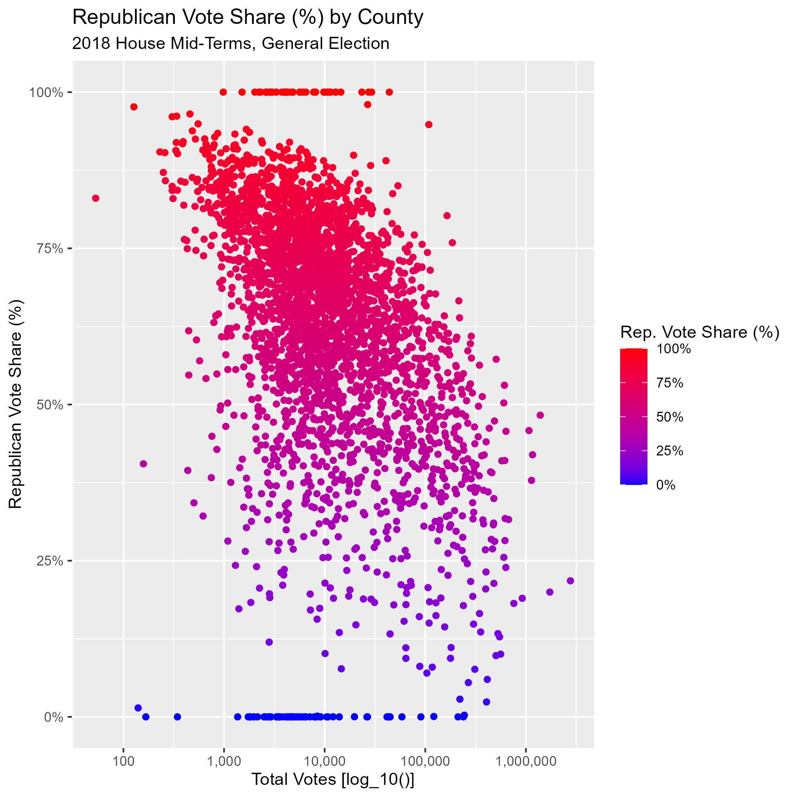

```{r setup, include=FALSE}
knitr::opts_chunk$set(echo = TRUE)
```

## File Set-Up

The first step of any R project is to ensure that the working directory and files system is sufficient for the task at hand. As such, we will be checking these before we begin any data work. The working directory, for me, points directly to the repository for this course. Assuming file set-up is kept the same, users should be able to navigate to any assignment in any week from this root. All files for this assignment are stored in the **week 3** folder of the repository. This assignment requires scripts, outputs, and figures, so these file paths will be included in this set. The *data* folder will contain multiple files due to the data's initial format as a .zip file. This folder will include the data itself as well as a codebook and a README.md file.

```{r files, results = "hide"}
getwd() #C:/Users/abiwe/OneDrive - The Pennsylvania State University/PLSC - Political Science/PLSC 498.1 - Visualizing Social Data/plsc_498"

list.files("03_week") #"data", "figures", "outputs","problem_set","scripts" 
list.files("03_week/data") #"codebook.md", "HOUSE_precinct_general.csv", "README.md", "cleanHouse.csv"
```

## Data Loading and Cleaning

Now that we have our files system set up, we can begin working with our data. To begin this exploration of our data and the role scaling plays in clarifying visualizations, we first need to import our data. We are specifically looking at 2018 general election data for the House of Representatives. This data set has more information than we need for our current goal, so we begin working with the data by filtering out the information we do not need. This will leave us with information relating to the main two parties during the general election. From here, we need to aggregate the total number of votes for each party and overall. To do this, we will use the *summarize* and *mutate* functions.

Below, we have a summary of information from our final data set.From the summary statistics, we can see a few things. Firstly, our data is skewed. In the total vote variable, the median and the mean are substantially different from each other (median of 8918 and a mean of 35825), indicating some highly populous counties vote count pulling at the mean. This is supported by the maximum value. There is also a slight skew in the vote share element, but it is not as severe. It is also in the *opposite* direction, with a median greater than the mean. We anticipate this will impact the visualizations that will be created in the next section.

```{r}
df <- read.csv("cleanHouse.csv")
nrow(df) #3088 counties
summary(df$county_total_votes)
summary(df$rep_share)
```

## Visualizations

The two visualizations shown (hopefully) below map the relationship between Republican vote share and total votes per county in the 2018 House mid-term general elections. The X-axis represents total number of votes and the Y-axis represents the vote share in each of the visuals. The scale for the two figures is the same as well - the more "Republican" a county is, the redder its point on the scatterplot is. The more "Democrat" a county is, the bluer its point is. The primary difference between these two plots is the scale the X-axis employs. In the first figure, the X-axis is not scaled at all, we are simply using the raw data. As discussed earlier, we know that there is a massive skew in the count of total votes. By not scaling our data to accommodate for that, our visualization is dominated by these larger counties, which hides the majority of our data from us. So, the next step was to change the scale of the X-axis. We opted to log our data in order to condense the spread of our values and to allow for a better view of all the points plotted. From this, we can see how total vote count and Republican vote share are related much more clearly. It seems, based on Figure 2, that smaller counties have a greater tendency to vote Republican as opposed to larger counties. This is a conclusion based on the slight downward trend of our plotted points as vote counts increase.


 The second visualization provides a much clearer and in-depth look at voting patterns within counties than the first one does. The only issue may be that the sheer difference in vote totals is not as clear without a closer look, but this is not central to the goal of the visualization. As such, it does not hinder interpretation and is far more appropriate to show an audience than the first visual created. Also note that the second visualization has its Y-axis represented in percentages, making interpretation even easier.

## Citations

1.  HOUSE_precinct codebook, codebook.md
