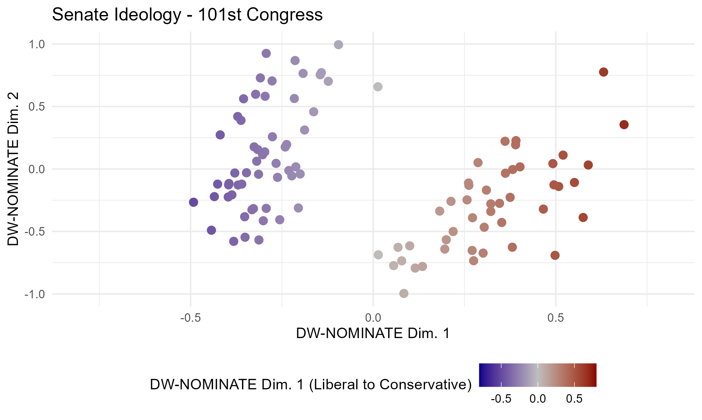

```{r setup, include=FALSE}
knitr::opts_chunk$set(echo = TRUE)
library(ggplot2)
library(dplyr)
```

## File Setup

As in all previous assignments for this course, the working directory for RStudio is set to the primary folder on my local machine for *all* PLSC 498.1 assignments. The details for this particular assignment can be found in the **04_week** folder in this directory. Data can be founded in the **data** sub-folder and all scripts and figures can be found in the folders of the same name.

```{r, results = "hide"}

getwd() #C:/Users/abiwe/OneDrive - The Pennsylvania State University/PLSC - Political Science/PLSC 498.1 - Visualizing Social Data/plsc_498"

list.files("04_week") #"data" "figures" "outputs" "problem_set" "scripts"    
list.files("04_week/data") #"Sall_members.csv"

```

## Data + Data Cleaning

The data for this assignment is sourced from *Voteview*, a site that allows users to explore and visualize politician ideologies. Ideology scores are calculated via **DW-NOMINATE**, a scaling developed by Keith Poole and Howard Rosenthal that addresses the socio-economic traits of politicians, as well as the positions of politicians on salient issues of the time^1^. The data set pulled from this site includes president and senator ideologies from the first Congress to present-day, with 10,125 observations over 22 different variables.

```{r}
df <- read.csv("Sall_members.csv")
dim(df)
names(df)
```

While this data is useful, we only need data for Senators during particular years for this assignment. As such, we are going to use the filter function to exclude all observations that do not fall in the following categories:

-   `congress` : observations included should only be those belonging to 101st, 106th, 111th, or 116th Congresses.

-   `chamber` : observations should be only indicated as "Senate".

Our purposes with this data is to explore Senator ideology during these four sessions. We will be utilizing the `nominate_dw1` (liberal-conservative/socio-economic) measure and the `nominate_dw2` (salient issues) measure for this exploration. The final data frame should only contain 417 of the original 10,125 observations. The code below shows the process of filtering the data.

```{r}
con <- c(101, 106, 111, 116)
df4 <- df %>% filter(chamber == "Senate" & congress %in% con)
dim(df4)
```

With this data, we are then able to build the four plots, each representative of a singular Congressional session.

## Plotting Ideology

Each visualization follows the same structural pattern. Every senator is plotted on a Cartesian coordinate plane with an X-axis ranging from -1 to 1 and a Y-axis with the same range. The X-axis represents our first ideology measure, `nominate_dw1`. The Y-axis represents `nominate_dw2`. In addition to this, points are colored based on the former. This color scale is *diverging*, being shades of **dark blue** at the negative end of the spectrum (representing liberal politicians) and **dark red** (conservative politicians) at the positive end. The middle point (0, a moderate politician) is represented by **light grey**. As a politician moves along this spectrum, the shading of their point corresponds to this scale. Moderate politicians on either side of the aisle will have muted hues while more extreme politicians will have a more vibrant red/blue color. This allows us to quickly distinguish where politicians fall ideologically instead of solely relying on position.

To maintain consistency across plots, all color scaling cut-offs and axes scales have been set manually. This allows us to more easily compare differences between the plots, as it means we do not need to readjust to new scales, both in value and hue. Because of this, we can clearly see that Senators have become more polarized socio-economically speaking in the last 35 years, but they have also become more moderate overall in relation to behaviors relating to primary issues of the day.




During the 101st Congress, Senators appeared to be more moderate overall, sticking primarily with in the .5 range of completely moderate (0) politically speaking. A good half of senators seemed to be even closer to moderate/center than that. In the 116th Congress, though, we see a wider dispersal of ideologies, with each group having its so-called "ideological center" solidly within a liberal or conservative stretch of the spectrum.

## Ensuring Accessibility

When working with data visualizations, it is imperative that color be properly used and portrayed to *all* that view the final product. As such, it is important that colors are not chosen at random and can be seen properly. Because of this, we opted to use blue-grey-red scale for the palette for these visualizations, as they are associated with the liberal-conservative ideological divide we are aiming to portray. In addition to this, we ensured the background was plain and point size was large enough to clearly see. The final test was to identify any issues with color blindness, which was tested using Colblindor's ColBiS^2^. Using this simulator, we viewed visuals through the lens of *Protanomaly* (red color blindness), *Tritanomaly* (blue color blindness), and Blue Cone Monochromacy. The visualization was deemed to still be effective even with these (and other) forms of color blindness. Even with both ends of the spectrum distorted (as in Blue Cone Monochromacy), the visualization still clearly distinguishes the two ends of the color scale.

## Commit Confirmation

## Citations

1.  Lewis, J. B., Poole, K. T., & Rosenthal, H. (n.d.). *Voteview: About the project*. Voteview. <https://voteview.com/about>
2.  Wickline, M. (2000). *Coblis - Color Blindness Simulator*. Colblindor. <https://www.color-blindness.com/coblis-color-blindness-simulator/>
