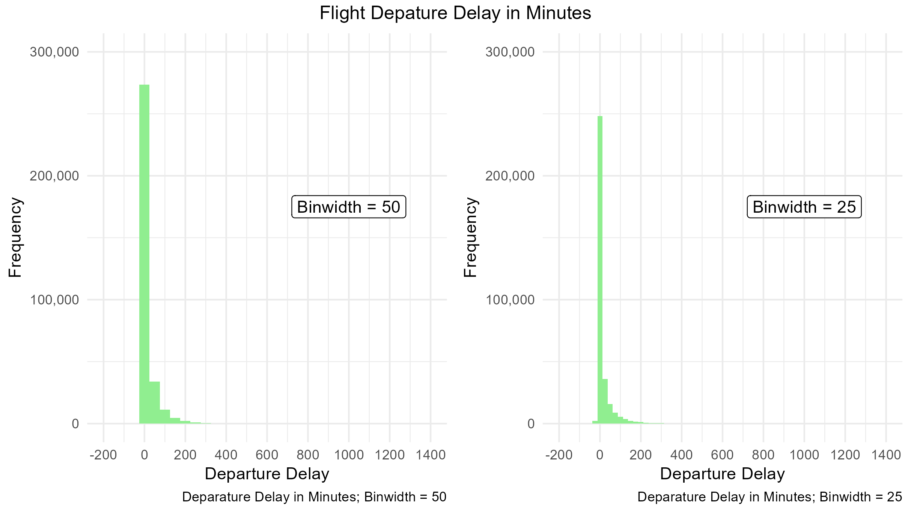
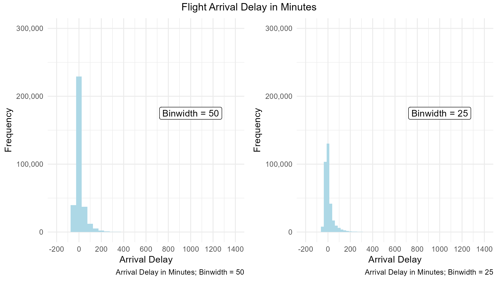
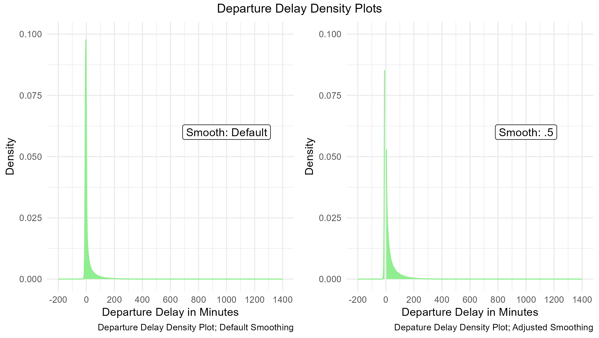
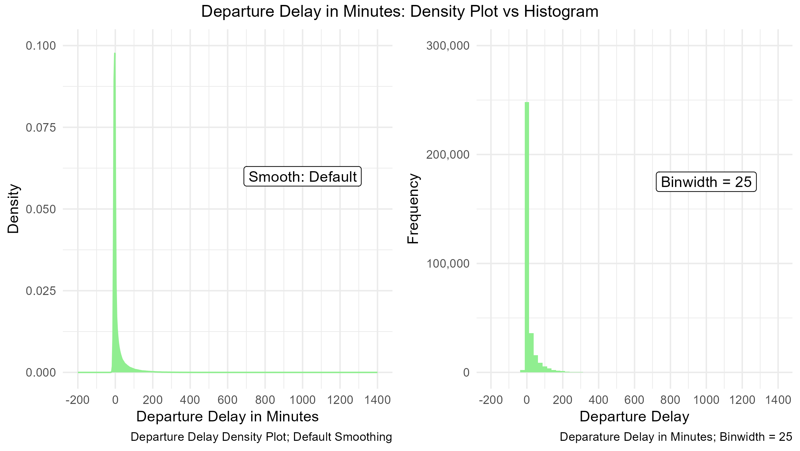
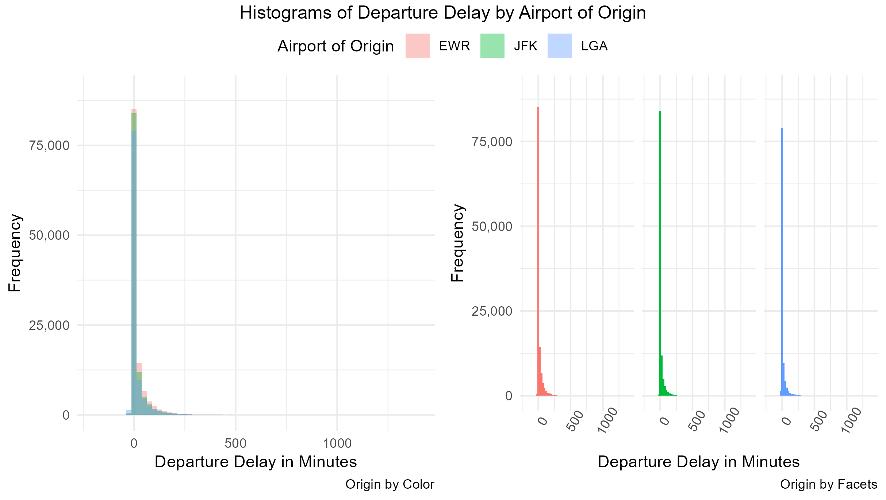
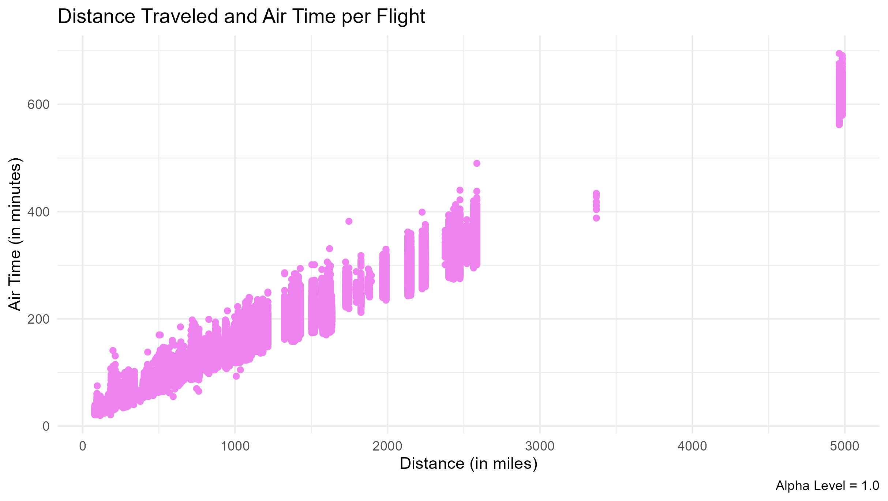

```{r setup, include=FALSE}
knitr::opts_chunk$set(echo = TRUE)
#import libraries
library(dplyr)
library(ggplot2)
library(ggpubr)
library(scales)
```

## Directory Set-Up

All necessary data, scripts, figures, and outputs can be found in the **06_week** folders of this repository in their respectively named sub-folders. Below is a summary of the file structure and working directory for this assignment.

```{r, results = "hide"}
getwd() #C:/Users/abiwe/OneDrive - The Pennsylvania State University/PLSC - Political Science/PLSC 498.1 - Visualizing Social Data/plsc_498

list.files("06_week") #"data" "figures" "outputs" "problem_set" "scripts" 

list.files("06_week/data") #"nycflights13.rds"
```

## Data and Data Cleaning

For this assignment, we will be working with the `nycflights13.rds` data set. This is a rather large data set (with our initial dimension function returning 336,776 rows and 19 columns), so we are going to cut it down to be more manageable. To do so, we will select six columns using the `dplyr` select function and filtering out all missing (N/A) values. The end result is a data frame with a slightly more manageable 327,436 observations across 6 columns. These columns are `dep_delay` (departure delay), `arr_delay` (arrival delay), `air_time` (time in the air), `distance`(distance traveled), `carrier` (airline code), and `origin` (airport of origin). Each will be used in this activity.

```{r}
#import data
df <- readRDS("nycflights13.rds")
dim(df)

#clean data
df <- df %>% filter(!is.na(arr_delay)) %>% select(c(dep_delay, arr_delay, air_time, distance, carrier, origin))
dim(df)
names(df)
```

## Lab Activities

The purpose of this lab is compare and contrast how design choices impact the appearance - and the resulting interpretation - of distributions of data. To better compare these pieces, I have included conjoined plots. These are intended to highlight how bin width, smoothness, grouping decisions, and overall plot choice influence how data is presented.

### Histograms and Bin Width

The two figures below show histograms for flight departure delays and flight arrival delays in two forms. The first plots in each figure have bars (or "bins") that hold all values in a 50-unit range (ie. Bin 1 = 0 - 49 minutes, Bin 2 = 50 - 99 minutes, etc.). The second plots in each figure hold all values in a 25-unit range (Bin 1 = 0 - 24 minutes, Bin 2 = 25 - 49 minutes). The choice of which bin width to use has significant influence on the way in which a plot is presented as it changes the number of values assigned to each individual bar.





The result is that we will see more significant modes (peaks) in the visuals that use larger bin sizes, as there are more presumably more values in a larger range than a smaller one. This increased modality in distributions with larger bin size may also result in distributions that appear more skewed than they actually are. Smaller bin sizes, on the other hand, adds more detail and may highlight points as significant that are not in reality.

The `arr_delay` histograms highlight the impact bin size (and bin count) have on distributions quite well, transforming a substantially skewed data distribution into a slightly-less skewed one. This simple change has halved the value the peak of our data distribution corresponds with and provides more detail for the data that falls below 0 minutes (early arrival). `dep_delay`, on the otherhand, does not do much in exemplifying the effects of bin size and only adds extra noise to the distribution already plotted out when it is reduced. This is partially due to the nature of the variable itself - we very rarely, if ever, see flights leaving earlier than planned. It should also be noted of these plots fail to highlight the extreme outliers of the data. It should be noted that this is likely due to the sheer scale of the data, of which there are over 300,000 observations. Outliers found past the 500 minute mark up to the 1,300 minute mark in the data, but because there are so few of these values they become merely a blip compared to the mass of data plotted elsewhere. Both figures highlight a right skew within the data, which is mostly concentrated in the bins around 0 minutes of delay, but extends much further out.

### Density Plots

Density plots are much like histograms in the sense that they plot the distribution of a variable. This time, instead of frequency of each data cluster, they plot out a smoothed estimate of the proportion of the data each "slice" represents (kind of). Similarly to histograms, density plots can be manipulated in ways that significantly impact distribution presentation. This manipulation is determined by the "smoothness" of the plot. Smoothness values below 1 create more variation in the plot while values greater than 1 decrease the variation shown. Dropping this smoothness value can create multi-modal distributions where there does not exist one and increasing smoothness can make any peaks completely disappear. We see the former presented in the second plot of the figure below - where there are two peaks surrounding the 0 minute mark. This is an artificial creation of the plot based on the way data is recorded - departure on the exact planned minute is rare. There does not *truly* exist two peaks in the data here, they are a part of the same curve in reality.



While density plots do have this fault, they are useful in the sense that they can highlight the extent of data distributions more effectively than histograms can. In the figure below, we compare the density plot and histogram of the same data. Distributions are roughly the same, but the tails in the density plot are more extensive. This is because it extends the entire length of the x-axis. This can be problematic as it may imply the existence of data that is not there, but in cases where data does exist at the extremes, it is helpful. In the histograms, there is no indication of data extending past \~300 minutes of delay. The density plots - in my perspective - indicate otherwise because of the behavior of the tails. Again: this is problematic in most other situations, but is suitable for the current one. When data sets are as vast as this one, I would opt to use a density plot over a histogram, as the scale prevents outliers from being noticed and is more susceptible to scaling errors in relation to bin size and number. Density plots, while also able to be manipulated, are more consistent and easily interpertable.



### Grouping Data

Another issue is relating to plotting distributions and design choices occurs when we are interested in plotting distributions for different categories. We are presented with two options: color or faceting. These are shown side by side in the figure below.



In the plot on the left of our figure, we can see the three distributions overlayed on each other. This makes it difficult to distinguish between distributions even with the color and transparency components. We can see some slight differences where they are not overlapping, but not very clearly. Because of this, we often opt to facet data - showing each category in a separate plot side by side. This allows us to make distinctions between the categories in data behavior that we otherwise would not have noticed through visualization alone. For example, faceting allows us to see that LaGuardia Airport has more departures before its planned time (- departure delay) than the other airports, which impacts the rest of that airports departure delay distribution.

### Data Transparency

While the color method of grouping data distributions was somewhat ineffective, the transparency of the overlayed histograms provided some interpertability that would have otherwise not have been there. Transparency of points is not only effective in that context, but also in other high-volume plots. The scatter plots below show this. The top figure is a scatterplot without transparency applied to its points. Data is clustered and melds into one, making it difficult to identify where the actual clusters are. The bottom figure has an altered alpha value, which controls transparency. In this plot, we can see where the clusters of data are because of the darker shading in those places. Without transparency, we would not be able to see this as clearly. Transparency lets us better examine dense data through allowing us to visually separate clustered plots more effectively due to changes in opacity. As such, it is necessary to use them when working with large and/or clustered data.




## Github Upload Confirmation

```{r}
#git status: 
# On branch main
# Your branch is up to date with 'origin/main'
# nothing to commit, working tree clean
#
#git log -1: 
#
#
#
```
