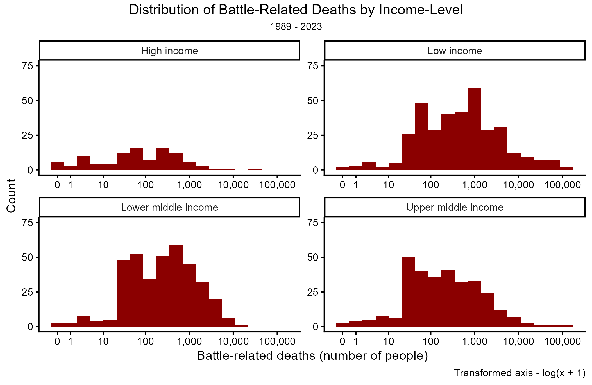

```{r setup, include=FALSE}
#import libraries
library(dplyr)
library(ggplot2)
library(scales)
library(ggpubr)
library(kableExtra)
```

## Directory Set-Up

All necessary scripts, figures, and data sources can be found within the **07_week** folder of this repository in the respectively named sub-folders. Below is a summary of the directory and file structure for this assignment.

```{r}
getwd() #C:/Users/abiwe/OneDrive - The Pennsylvania State University/PLSC - Political Science/PLSC 498.1 - Visualizing Social Data/plsc_498

list.files("07_week") #"data", "figures","outputs", "problem_set", "scripts"   

list.files("07_week/data") #"battle_deaths.rds"
```

## Data and Data Cleaning

For this exercise, we are utilizing data from `battle_deaths.rds`. This data tracks battle deaths per year by country for those in active conflicts around the world between 1989 and 2023. A total of $108$ countries are represented within the data. Each observation (`country`-`year`) also includes `region` and `income` flags in addition to battle death data. The complete data set contains $1141$ observations over the following $6$ variables: `iso2c` (ID), `country` , `year` , `battle_deaths` , `region` , `income`. There are $7$ unique categories in the `region` variable and $5$ unique categories in the `income` variable. These will become relevant in future activities.

```{r, message = FALSE}
#load data
df <- readRDS("07_week/data/battle_deaths.rds")

#check data dim
dim(df)
names(df)

#details of data
range(df$year)
list(unique(df$country))
list(unique(df$region))
list(unique(df$income))
```

The variable of interest for this lab is `battle_deaths` . Before beginning to create visuals, we should explore this variable more in-depth. To do so, we present a table of summary statistics for the `battle_deaths` variable. This is shown in @tbl-summary below.

```{r}
#| label: tbl-summary
#summary table
df2 <- df %>% select(battle_deaths)
sum <- as.data.frame(apply(df2, 2, summary)) %>% 
  kbl(caption = "Summary Statistics of Battle Deaths (1989 - 2023)", col.names = c("Stats", "Battle Deaths"), align = "l", format.args = list(big.mark = ",")) %>% 
  kable_styling(bootstrap_options = "striped")
sum
```

We should note that the minimum of our variable of interest is $0$ - indicating $0$ deaths during that conflict year for a given country. This is the lowest possible value we can have in this variable. The maximum observation, though, rests at over $160,000$ deaths in a given conflict year. If we examine the mean and median values also produce, we will see that this is an *abnormally high observation*. The median value of our `battle_deaths` variable is only \~$240$, indicating that $50$% of our data is at our below that threshold. The *mean* is nearly $2,000$ deaths though - much higher than the median. A normal distribution would have a mean and median that are about the same in value. However, our mean is significantly higher than our median. This, paired with the high maximum value indicates to us that our data is **right skewed** to a substantial degree. This will impact how our data is plotted in the following steps.

## Preparing for Visualization

The purpose of this assignment is to examine how skewed data impacts visualizations and is represented in plots of distribution. To do this, we will be comparing and contrasting data that has been transformed and data that has not been altered. In many visualizations, we will be using the `trans = "log1p"` argument to transform the axis. However, when plotting QQ plots and deciding binning, this is not an option. As such, we transform are creating an additional variable, `trans_battle`, that represents the transformed data. To do so, we add a value of $1$ to each observation in `battle_deaths` and log the data as we need to use it.

We also write out our binning formula, which is Scott's Rule, to be applied for each binning option on non-transformed histograms. These two steps are shown in the code chunk below.

```{r}
#binning decisions:
scott <- function(x) {
  n <- length(x)
  s <- sd(x)
  3.5 * s * n^(-1/3)
}

#transformation info: 
df <- df %>% mutate(
  trans_battle = battle_deaths + 1
)
```

From here, we can begin to plot our visualizations.

## Plotting Battle Deaths

In this section, we plot `battle_deaths` in four separate mediums: histograms, density plots, QQ-plots, and faceted histograms.

### Histograms and Density Plots

Each figure below has two plots within it. On the left, the baseline axes are used to plot data. We see that this shows the heavy skew that was noted in @tbl-summary . On the right of each figure is the logged axis. The data that is plotted is the same, but the scale at which it is placed on the axis is different. In the raw data plots, it appears that values that are close to zero make up the majority of the data. While relative to the high ends of the distribution this is true, transforming our axis allows us to see the detail of specifically what point groupings are substantial within the data.


The leftmost plots in each figure, in this format, also fail to really highlight these high points in the data. As there are only a few observations in each high value bin, these values become imperceptible when there are high concentrations of data on the other end of the data distribution. This impedes the ability of viewers to understand the spread and skew of the data. Transforming the axis on which these values are plotted allow us to better see these tails and the frequency at which values in this high value bins occur. Untransformed, the `battle_deaths` data is severely right skewed and is limited in showing variation within the data in visual format. Transforming the axes (or data) as a logged variable provides us with a more normally distributed variable that can be better used to gain insights into the distribution. For example, logging the axis highlights that our peak(s) in our data are around the \~$100$ battle deaths mark and the \~$1000$ battle deaths mark. Without this transformation, we would not be able to make this judgement.

### QQ Plots

Q-Q or Quantile-Quantile plots are used to evaluate the normality of data or residuals of model. In this assignment, we are using the QQ plots to evaluate normality of our `battle_deaths` variable and our transformed variable (`trans_battle`). Note that we explicitly use this transformed variable due to the lack of `trans = "log1p"` argument applied in visual formation. Below, we can see the QQ plots with transformed data on the right and raw data on the left.


The QQ plot on the left highlights just how skewed our data is relative to what would be a normal distribution of the data. The left tail is slightly flat but otherwise normal for most of the distribution until we reach the $x = 1$ position of the x-axis. Here, we see our data pulling away from the normal line at an exponential rate. This indicates to us that not only is our data right skewed (right values above the predicted values and thinly dispersed), but it is also non-linear and likely exponential in nature. This would impact any work done with this data substantially and should be transformed before us. To do so, we take the $log(x + 1)$ of the data, as $ln(x)$ is the inverse of $e$ . The assumption of this transformation is that the data would be normal afterwards. The QQ plot on the right supports this assumption, as all transformed points follow the line of predicted quantiles more accurately. The multi-modality of the transformed distribution is highlighted, seen in the bump up off the quantile line around $x = -1$. While the multi-modality may be an issue later, this data is now more sufficient for use beyond poor visualization as a result of transformation.

### Faceted Histograms

As mentioned earlier, there were also `income` and `region` values included for every observation. We want to explore the distribution of `battle_deaths` by each of the categories in those variables. Each of these are built using the `trans = "log1p"` argument for clearer comparisons within and across distributions.

#### *Facet by Region*


The `region` variable contains $7$ separate categories. However, due to a lack of data in one category (North America), there are only six plotted in this visualization. To ensure proper comparisons are being made, the scaling for both the x- and y- axes were set manually. Each histogram is then plotted the same way relative to each other and differences in size and spread are properly represented. What immediately stands out is the overall count of battle deaths in the Sub-Saharan Africa region compared to the rest of the regions represented. This data is also *multi-modal* whereas the other distributions really are not. Also noted is that the distributions of data are not normal across all regions, but are also left skewed or right skewed in some cases.

#### *Facet by Income*

{width="660"}

Like with the region data, we did drop a category of observations from this group of plots. In this case, we dropped the "Not Classified" category, as this does not offer us any information on how income of a country is related to battle related deaths. Also like the previous faceted plot, we ensured that all scaleings are consistent across all facets. What is noted here is that all distributions are closer to normal when data is transformed, regardless of income. Secondly and perhaps more important to the discussion is that difference in density across income facets. "High Income" countries have very few instances of war at all relative to lower and middle income countries, which then manifests as lower counts of battle deaths per conflict per year overall.

## Github Confirmation

```{r}
#git status: 
# On branch main
# Your branch is up to date with 'origin/main'
# nothing to commit, working tree clean
#
#git log -1: 
#
#Author: weinsteinabi <abiweinstein@gmail.com>
#Date:   Thu Feb 26 17:06:09 2026
#        week 7 assignment + pull midterm info
```
