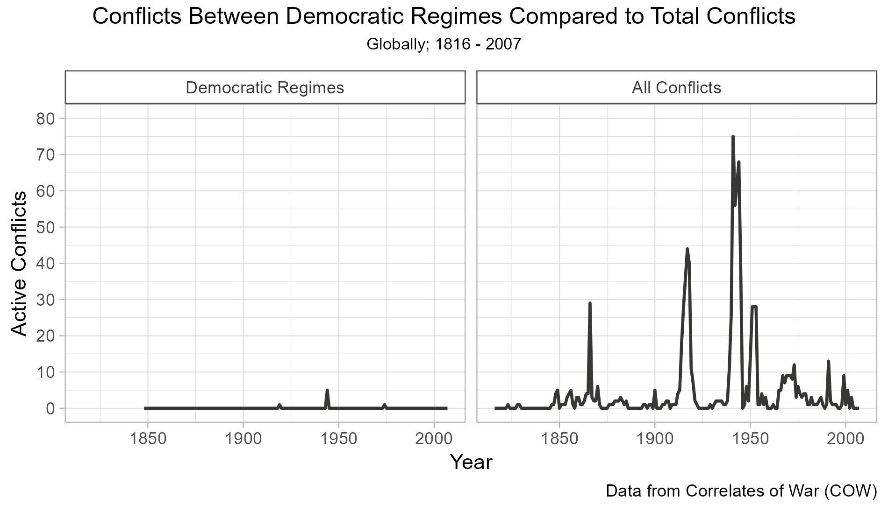
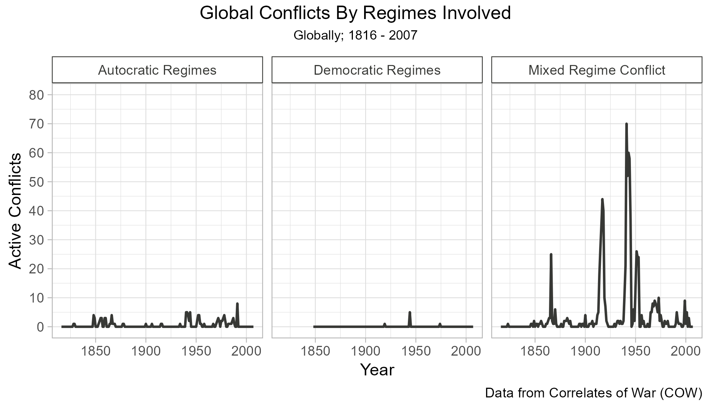
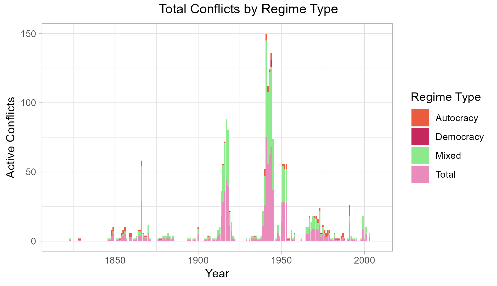
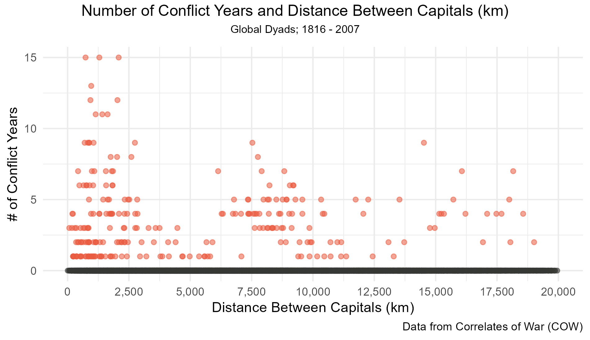
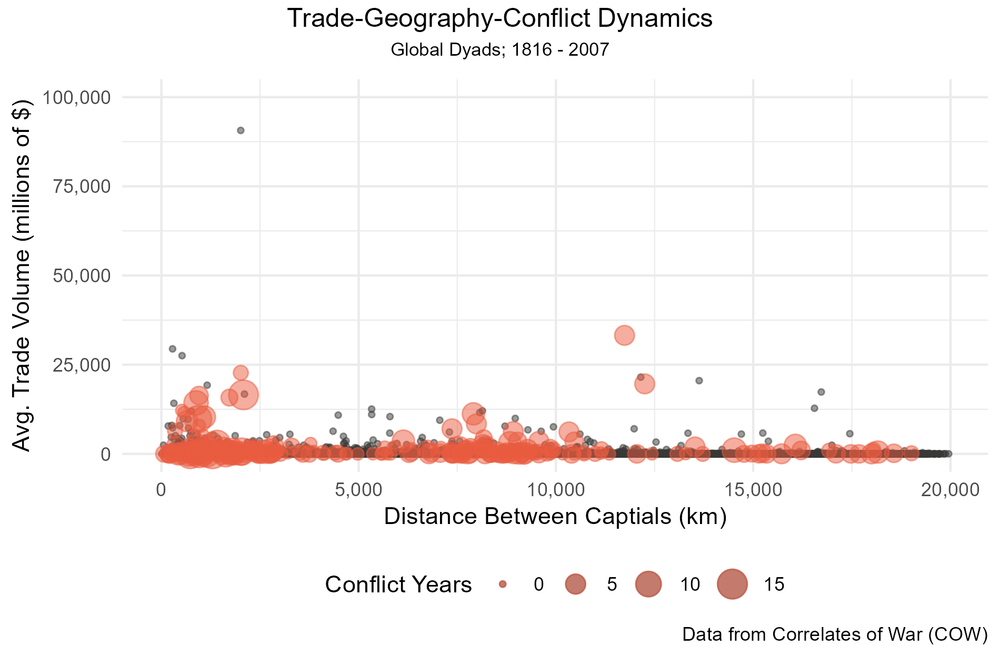
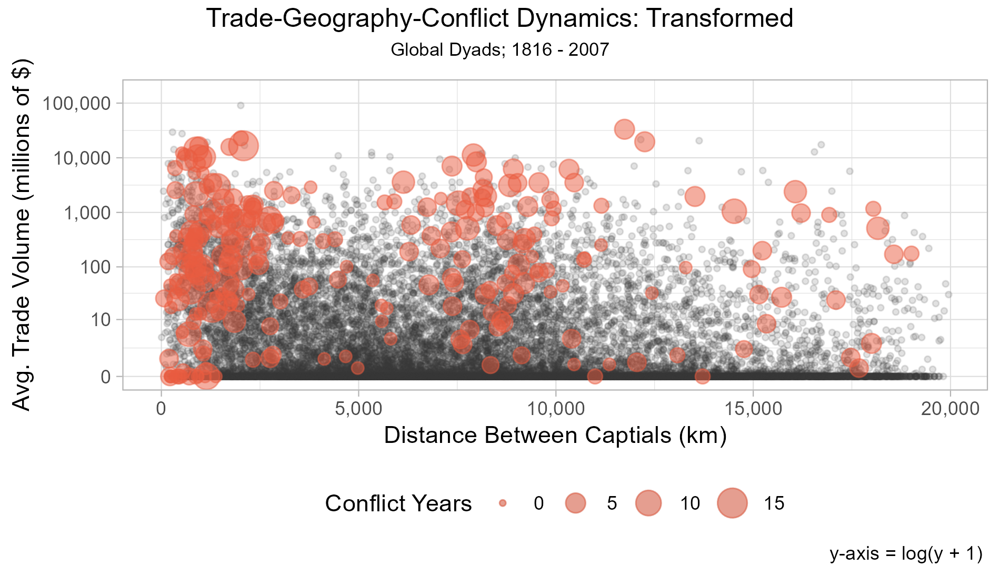

```{r setup, include=FALSE}
knitr::opts_chunk$set(echo = TRUE)
#import libraries
library(ggplot2)
library(dplyr)
library(tidyr)
library(ggpubr)
library(scales)
```

## Data Construction Decisions

For this assessment, students were instructed to develop visualizations exploring trends in conflicts using data from a Correlates of War (COW) data set. Correlates of War is a political science project dedicating to exploring warfare across modern history. The project collects data related to not just conflict occurrences and actors, but also additional factors that influence war and foreign relations in general. The data set provided to students spans from 1816 to present day (2025) and is structured such that each observation is a dyad-year. An example observation would be "1920-USA-Canada" and examine variables relating to the relationship between the US and Canada in 1920. The raw data includes the following variables: `year` , `ccode1 + 2` , `iso3c1 + 2` , `capdist` (in km), `trade` (in millions \$), `polity21 + 2` , `cowinterongoing` , `cowinteronset` , and `initiator1 + 2`. The data set totals $1,125,420$ observations, which is admittedly too much for my PC to manage and makes it difficult to extract trends. As such, we are going to clean the data and separate it into two data sets: system-year and condensed dyad-year.

```{r}
#| results = "hide"
df <- readRDS("data/conflict_data.rds")
dim(df)
names(df)
```

### Data Cleaning Decisions

For the purposes of the this assessment, we are utilizing `cowinterongoing` as our outcome variable, as this assesses the length of a conflict. It should be noted that each conflict is only recorded once per year in the data set. This eliminates any concern we have about duplicated data in our outcome variable later on. To create effective visualizations, we need to have a compete, clean data set in regard to our outcome variable. As such, we first chose to **filter out all missing values for `cowinteronging`**. This removes all data from after the year 2007. In addition to this, we also remove the `initiator` columns. These columns flag which nation in the dyad began the conflict. While this is important data, it is not relevant to our current exploration of the data. After completing these two steps, all other data cleaning and aggregation tasks are unique to each data set we are creating.

```{r}
#| results = "hide"
df_clean <- df %>% filter(!is.na(cowinterongoing)) %>% select(-c(initiator1, initiator2))
```

### System-Year Data Decisions

To create the system-year data set, we need to transform the cleaned dyad-year data set into a data set with yearly observations for system groups. The resulting unit of analysis should be similar to this: "1816-Democracy". Initially, we were going to create a wide data set that was made of year observations with associated regime counts and total in a single row, but this created complications in visualization tasks. This is why we have a long data set in the format described above.

The tasks associated with this data set are related to the types of regime *pairs* that exist in conflicts. This means our first step is to take the cleaned data set and create a paired regime variable, called `regime_id`. To do this, we utilized the `mutate` command paired with the `case_when` subcommand. We created three separate classifications. For dual democracy conflicts, the `regime_id` variable is assigned "Democracy". Dual autocracy conflicts follow a similar logic. Mismatched pairs of democratic/autocratic regimes, or any pair involving *anocracies* (pseudo-democratic regimes) are assigned the "Mixed" regime value. We include anocracies in this analysis to gain a more robust understanding of regime and war. Once this was done, we grouped data by `year` and `regime_id` to create a variable (`war_sum`) that holds the count of active conflicts in that year for that regime type. Next, all variables but `year` , `regime_id` , and `war_sum` were dropped from the data set, as they do not include data necessary for future visualizations. Data was then filtered to only include unique observations. The final step was ensuring that there was a total count of conflicts for each year. To do so, we create a function of the `add_row` function to sum each `war_sum` observation in a year. The result is the count of all wars regardless of regimes involved.

The final data frame, called `df_year`, has a total of $736$ observations across our three variables.

```{r}
#| results = "hide"

df_year <- df_clean %>% mutate(
  regime_id = case_when(
    polity21 == "Democracy" & polity22 == "Democracy" ~ "Democracy", 
    polity21 == "Autocracy" & polity22 == "Autocracy" ~ "Autocracy", 
    (polity21 != "Autocracy" & polity22 == "Autocracy") | 
      (polity21 != "Democracy" & polity22 == "Democracy") | (polity21 == "Anocracy") | (polity22 == "Anocracy") ~ "Mixed"
  )
)
df_year <- df_year %>% group_by(year, regime_id) %>% mutate(
  war_regime = sum(cowinterongoing) 
)
df_year <- df_year %>% select(c(year, regime_id, war_regime)) %>% unique()
df_year <- df_year %>% group_by(year) %>% group_modify(~add_row(.x, regime_id = "Total", war_regime = sum(.x$war_regime)))

```

### Dyad-Year Data Decisions

The condensed dyad-year data set will be used to explore relationships between distance, trade, and war. Because we are now working with three variables, we need to address the existence of all three to create a functioning data set. A quick examination of the data indicates to us that there is no missing data in our `capdist` variable. `trade` , however, has significant chunks of missing data. Most of this is either a result of countries having no trade with each other, either due to trade blockades or the Great Depression. While we could simply drop the missing values, I believe it is more beneficial to subsitaute this data in with zero-values, as it is likely what the missing values are supposed to represent. After addressing this, we can begin collecting necessary data.

Because this data set is so large ($786,492$ observations), my computer cannot support the visualizations it needs to build using the data. As such, we opted to condense the data to by a dyad data set, with units being the country relationship alone. To make proper visualizations using this form of data, we needed to average the trade volume in each country relationship before cutting down the data. Average distance between capitals was taken to account for capitals possibly changing over time (such as in Japan). We then added the number of years at war within each country dyad (`war_sum`). The frequency of war (`war_freq`) was also calculated. After these aggregation tasks were completed, the following columns were removed from the data set, as they do not support the required visualization tasks: `year` , `ccode1 + 2` , `polity21 + 2` , `trade` , `cowinterongoing` , and `cowinteronset` . The data was filtered such that only unique observations were included, resulting in one observation per country dyad.

The final data set, `df_dyad`, is $18,669$ observations across six columns. This number is a result of not all countries having relationships with all other countries in the data.

```{r}
#| results = "hide"
df_dyad <- df_clean %>% filter(!is.na(capdist)) %>%
  group_by(iso3c1, iso3c2) %>% 
  mutate(
  capdist = sum(capdist)/n(),
  trade = ifelse(is.na(trade), 0, trade), 
  avg_trade = sum(trade)/n(), 
  war_sum = sum(cowinterongoing),
  war_fre = war_sum/n(),
) %>% select(c(iso3c1, iso3c2, war_sum, war_fre, capdist, avg_trade)) %>% unique()
```

With our data prepared, we can now begin to work on constructing and exploring our visualizations.

## System-Year Data

The following visualization tasks will utilize the `df_year` (system-year) data set. The first task is to compare total conflicts to wars between democracies over time. The second is to compare conflicts across regime types over time. For both of these visualizations, line plots with faceting were used. No color was utilized in these tasks, as distinct groups are separated by their facets. It also allows for a more accessible, cleaner view. The bad visualization task will also be included in this section.

### System-Level War Trends



The goal of this first visualization is to identify how democratic regime wars (wars between two democracies) contribute to the total number of conflicts. We are exploring this relationship with respect to time to identify any possible coinciding trends between the two groupings of data. In the two line plots above, we immediately note that the number of democratic wars is very low in comparison to the total number of conflicts. This indicates that only a small fraction of international conflicts are between two democratic powers. We also note that there appears to be a relationship between when democratic wars occur and conflict occurrence regardless of regime. When overall war occurrence is high, we see the appearance of democratic conflicts. This trend is noted especially during the periods of WWI and WWII, where we see the highest number of warring countries *and* the introduction of warring democracies.

For this visualization, we opted to uses a faceted line plot with the scale representing the count of conflict events. This was not the first choice in visualization fo this task, which was a stacked bar chart that displayed democratic wars as a portion of the total war count. Were the span of years more condensed, this would have been the course of action taken. However, with over $190$ years included in the data set and democratic conflicts being such a small portion of the data, this style of visualization was deemed ineffective. A line plot reduces visual noise in such a densely populated data set and is often utilized to represent trends over time, so we pivoted to this. In choosing to use the line plot, though, we have forgone showing democratic conflicts as a proportion of total conflicts, which would have been ideal, but visual clarity is necessary for that task and there was very little in the initial method of plotting. There was still the scaling issue, though, as the difference in scale of the two groups made it difficult to clearly identify democracy trends when in the same plot. For this reason, we opted to facet the data so the two trend lines were plotted side-by-side. We maintained the same scaling range and interval for each plot to promote more effective comparisons of the data. Because faceting was used, color was omitted from the plot. Smoothing was also omitted, as it muddles the true values associated with each year and therefore limits the ability to compare trends between the two plots.

### Regime Type Comparisons

After exploring the differences between democratic regime wars and total wars, we should examine how war counts vary across the other regime dyads. The intention behind this visualization task is then similar to the first - to determine how regimes contribute to global conflict.

The visualization above divides each regime into its own facet within the overall figure. Immediately, it is apparent that most conflicts can be attributed to inter-regime disputes. The trends in our "Mixed Regime Conflict" facet are nearly identical to those in the "Total Conflicts" facet in the previous plot. After this, conflicts between autocratic regimes are more common. Interestingly, the trends in autocratic conflicts are the inverse of democratic conflicts, with more occurring *outside* major war periods rather than within them. Overall, the plots imply that countries rarely fight those with the same regime as them. Autocratic conflicts peak at a little less than $10$ total conflicts in the late 1990s. Democratic conflicts peak at five active conflicts during the WWII period. Mixed conflicts, however, peak at nearly $70$ individual conflicts in that same period (Note: "individual conflicts" refers to pairs of countries at war with each other, not necessary independent wars).

Like the previous visualization, we opted to utilized faceted line plots to explore the trends in conflict over time by regime. Just as before, a stacked or grouped bar chart was considered, but due to the same reasons of visual clutter and gross differences in frequency, it was eventually decided against. Overlaying line plots would cause similar issue, even without considering the need to have distinct colors in the plot. Because of line plots proven efficacy in representing trends over time and the need to show each grouping clearly, the faceted line plot was deemed best for this task. Each grouping is clearly labeled with what it represents and is scaled such that it can be compared with the visualization from the previous tasks effectively.

### Bad Visualization

Below is an example of what a "bad" visualization would look like for this data set and task.



This data set is a bar plot displaying count of active conflicts each year by regime. This was conducted without data transformation during the plotting process. As such, the total count of conflicts is included in addition to regime counts. By stacking the bars (which, had `regime_id = "Total` been filtered out, would have shown regimes as a proportion of the total), we now have an inaccurate measure of the number of conflicts per year. For example, in 1941, there were at total of $75$ active individual conflicts globally. This plot, however, implies that there were $150$, because it counts both the individual regime counts and the total count together. Beyond this, the title itself implies that "Total" is a type of regime, as does the legend. This could be interpreted as representing totalitarian regimes. Finally, the color encoding is not meaningful nor is it accessible, resulting in an ugly, hard-to-read visualization. This plot also serves as an example of why we chose *not* to use bar plots; the lower count groupings are very difficult to identify in the plot.

## Dyad-Year Data

The following section involves the visualization tasks that utilize our condensed dyad-year/country-dyad data set (`df_dyad`). These tasks are intended to explore the relationships between war, distance between countries, and trade volume. The first task takes distance and war alone. The second explores all three. The second task is also utilized to address how transforming axes can impact a visualization. For these visualizations, scatter plots were used and war observations were highlighted in red.

### Distance-War Relationships



The first task is to explain the relationship between how often a pair of countries is at war with each other relative to how far apart they are located. To represent war occurrence, we counted the number of years each country-pair was observed as being at war. For example, China and Japan were observed as being at war with each other for $15$ years within the observation period (1816-2007). The trend displayed is not incredibly strong, but indicates that conflicts occur less or for short periods when countries are separated. An example of this would be found in the wars of Great Britain, who spent $12$ years at war with Germany ($931$ km away), but only one year at war with Afghanistan ($5,700$ km away). There are, of course, other factors, that will be addressed in the coming models. What should be noted in this plot is that war is *rare*. We know this as a result of visualization techniques utilized.

In our visual, we have two groupings of scattered points. First and most eye-catching are the red war points. These are the points of countries that have been at war with each other. The second group of points are the black points, dispersed at `war_sum = 0` . These are the points of country pairs that have not engaged in conflict. This color choice was implemented to draw the users eye to the most important part of the plot. The other visual choice implemented in this plot is transparency. All points, regardless of grouping, have the same `alpha` level. Despite this, the black points are very nearly a solid black line. The red points, though, are faint. This difference highlights the sheer difference in number of values associated with each grouping, which then emphasizes to viewers that war is rare. Closer analysis of the data directly tells us that there are only $255$ of the $18,669$ observations where conflict is noted.

### Trade-Distance-War Dynamics

The following visualizations display two different approaches to the analysis of how trade volume, distance, and war relate to each other. One visualization introduces scaling of the y-axis (trade volume), while the other leaves data untouched. Beyond this, the approaches to visualization are the same. Like with the previous visualization, data points that represent dyads where war occurred are highlighted red to bring those points to the viewers attention. The continuous variables of the three-way relationship, distance and trade volume are encoded on the x- and y-axis respectively. Years of war in the dyad is encoded as size as to include the frequency metric in addition to just general occurrence. The visualization opted for is a scatter plot, as these are effective for showing the relationships between continuous values. Due to the density of our data, transparency was also included in the visualization creation to help distinguish where data clusters lay. The final universal visualization decision was to plot the war occurrences such that they are in front of the other points. This helps separate the two groups visually.

#### Raw Visualization

The first plot of the trade-distance-war relationship leaves much to be desired. It highlights two war clusters in the data ("high" trade volume, low distance & "low" trade, middle-distance), but beyond this it leaves much to be explained. This is primarily a result of the scale of the y-axis. There are some countries that engage in very high amounts of trade, which expands the range of our trade volume measure greatly. However, most of our observations do not exist in that space, creating a cluster of points that is does not allow for distinction. This makes it difficult to identify what relationships exist beyond the cluster.



Because of this scaling issue, we have created a second iteration of the plot that transforms our y-axis.

#### Transformed Axis

Once we transform data, it is significantly easier to identify the relationship between trade, distance, and war (not just occurrence, but frequency). This is because transforming our axis expands the space in which our lower values can exist, letting us more easily visualize what is happening in those clusters. The relationship shown among dyads with no conflict is as expected: trade declines as distance increases. Our interest is in those dyads with conflict though. The plot reiterates the relationship between distance and war, with the larger points (which represent higher-conflict pairs) being grouped near the low end of our x-axis. What is added to this understanding is how trade volume plays into the relationship. Of course, with this transformation, the jumps in trade volume are not as clear as in the previous plot so the scale of the relationship is skewed slightly. Despite this, the plot still effectively displays the relationship. The scatter plot implies that higher rates of conflict exist between countries that have greater trade relations, as do instances of conflict in general. This relationship is not as clean cut as the relationship between distance and war, but it is still apparent within the data. This plot, in addition to displaying relationships more clearly, also emphasizes the difference in frequency of conflict dyads and peaceful dyads.



If we were to present this relationship to policymakers, we would opt for the version with the transformed axis. The same is true for presenting to a methods audience. The transformed version allows viewers to more easily identify relationships in the data. For policymakers, it is necessary that they understand these general relationships to inform their policy. Providing a visual that does not clearly display that relationship would not be beneficial, even if they would likely not notice the axis transformation. A methods audience, however, would, and would use that to inform their inferences. These inferences, though, still rely on being able to clearly see the relationships between variables.

## Git-Hub Confirmation

```{r}
#git status: 
# On branch main
# Your branch is up to date with 'origin/main'
# nothing to commit, working tree clean
#
#git log -1: 
#
#Author: weinsteinabi <abiweinstein@gmail.com>
#Date:   Tue Mar 3 15:26:57 2026
#     midterm initial push
```

## Visualization Code Appendix

```{r}
#system-year: system-level war trend
war <- c('Democracy' = "Democratic Regimes", 'Total' = "All Conflicts")
system_war <- ggplot(df_year[df_year$regime_id %in% c("Total", "Democracy"), ], aes(year, war_regime)) + 
  geom_line(linewidth = .75, color = '#373835') + 
  scale_y_continuous(limits = c(0,80), n.breaks = 8) +
  facet_wrap(~regime_id, labeller = as_labeller(war)) + 
  labs(
    caption = "Data from Correlates of War (COW)",
    x = "Year", 
    y = "Active Conflicts"
  ) + theme_light() + theme(strip.text = element_text(color = "#373835"), 
                            strip.background = element_rect(fill = "white", color = "#373835"), 
                            legend.position = "none")
title <- expression(scriptstyle("Globally; 1816 - 2007"))
system_war <- annotate_figure(system_war, top = text_grob(title))
system_war <- annotate_figure(system_war, top = text_grob("Conflicts Between Democratic Regimes Compared to Total Conflicts"))

#system-year: regime type trends
war <- c('Democracy' = "Democratic Regimes", 'Autocracy' = "Autocratic Regimes", 'Mixed' = "Mixed Regime Conflict")
regime_war <- ggplot(subset(df_year, regime_id != "Total"), mapping = aes(x = year, y = war_regime)) + 
  geom_line(linewidth = .75, color ='#373835') + 
  scale_y_continuous(limits = c(0, 80), n.breaks = 8) + 
  facet_grid(~regime_id, labeller = as_labeller(war)) +
  labs(
    caption = "Data from Correlates of War (COW)", 
    x = "Year", 
    y = "Active Conflicts", 
  ) + 
  theme_light() + 
  theme(strip.text = element_text(color = "#373835"), 
        strip.background = element_rect(fill = "white", color = "#373835"), 
        legend.position = "none")
regime_war <- annotate_figure(regime_war, top = text_grob(title))
regime_war <- annotate_figure(regime_war, top = text_grob("Global Conflicts By Regimes Involved"))

#system-year: bad visualization
bad_vis <- ggplot(df_year, aes(year, war_regime, fill = regime_id)) + 
  geom_bar(position = "stack", stat = "identity") + 
  scale_fill_manual(values = c('#ea5b3f', '#c6275c', '#8cea8c', '#ea8cbb')) + 
  labs(
    x = "Year", 
    y = "Active Conflicts", 
    fill = "Regime Type"
  ) + theme_light()
bad_vis <- annotate_figure(bad_vis, top = text_grob("Total Conflicts by Regime Type"))

#dyad-year: distance-war relationship
dist_war <- ggplot(df_dyad, mapping = aes(capdist, war_sum)) + 
  geom_point(aes(alpha = .3, color = cut(war_sum, c(-Inf, 0.001, Inf)))) + 
  labs(
    x = "Distance Between Capitals (km)", 
    y = "# of Conflict Years", 
    caption = "Data from Correlates of War (COW)"
  ) + scale_color_manual(values = c("(-Inf,0.001]" = "#373835",
                                    "(0.001, Inf]" = "#ea5b3f")) + 
  theme_minimal() + 
  theme(legend.position = "none") + 
  scale_x_continuous(limits = c(0, 20000), n.breaks = 10, labels = comma) + 
  scale_y_continuous(limits = c(0, 15), n.breaks = 3)
title <- expression(scriptstyle("Global Dyads; 1816 - 2007"))
dist_war <- annotate_figure(dist_war, top = text_grob(title))
dist_war <- annotate_figure(dist_war, top = text_grob("Number of Conflict Years and Distance Between Capitals (km)"))

#dyad-year: trade-distance-war dynamics, raw: 
tdw <- ggplot(df_dyad, aes(capdist, avg_trade, size = war_sum)) + 
  geom_point(data = df_dyad[df_dyad$war_sum == 0, ], alpha = .5, color = "#373835") + 
  geom_point(data = df_dyad[df_dyad$war_sum > 0, ], alpha = .5, color = "#ea5b3f") + 
  labs(
    x = "Distance Between Captials (km)", 
    y = "Avg. Trade Volume (millions of $)", 
    size = "Conflict Years", 
    caption = "Data from Correlates of War (COW)"
  ) + theme_minimal() + 
  scale_y_continuous(label = comma) + 
  scale_x_continuous(label = comma) + 
  theme(legend.position = "bottom")
title <- expression(scriptstyle("Global Dyads; 1816 - 2007"))
tdw <- annotate_figure(tdw, top = text_grob(title))
tdw <- annotate_figure(tdw, top = text_grob("Trade-Geography-Conflict Dynamics"))

#dyad-year: trade-distance-war dynamics, transformed: 
tdw_trans <- ggplot(df_dyad, aes(capdist, avg_trade, size = war_sum)) + 
  geom_point(data = df_dyad[df_dyad$war_sum == 0, ], alpha = .15, color = "#373835") + 
  geom_point(data = df_dyad[df_dyad$war_sum > 0, ], alpha = .5, color = '#ea5b3f') +
  labs(
    x = "Distance Between Captials (km)", 
    y = "Avg. Trade Volume (millions of $)", 
    size = "Conflict Years", 
    caption = "y-axis = log(y + 1) "
  ) + theme_light() + 
  scale_y_continuous(label = comma, trans = "log1p", limits = c(0, 150000), breaks = c(0, 10, 100, 1000, 10000, 100000)) + 
  scale_x_continuous(label = comma) + theme(legend.position = "bottom")
tdw_trans <- annotate_figure(tdw_trans, top = text_grob(title))
tdw_trans <- annotate_figure(tdw_trans, top = text_grob("Trade-Geography-Conflict Dynamics: Transformed"))

```
