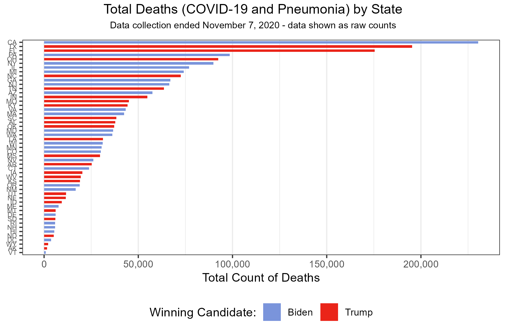
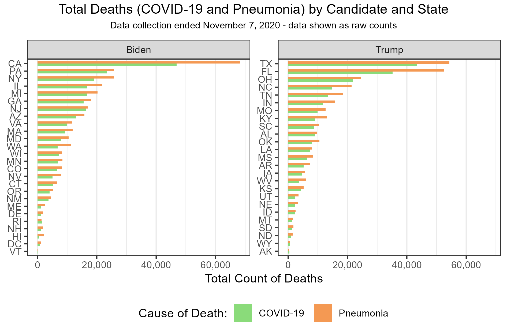

```{r setup, include=FALSE}
knitr::opts_chunk$set(echo = TRUE)
library(ggplot2)
library(dplyr)
library(tidyr)
library(ggpubr)
library(scales)
```

## Data Description and Wrangling

For the following lab assignment, we will continue to use the established filing system - all files can be found in their respective folders under the **09_week** folder of the repository. This week, we will be working with election and COVID-19 death data from 2020. This data contains an observation for every state and the District of Columbia, resulting in $51$ observations. Each observation includes state name (`state`) and abbreviation (`state_po`) (ex: "Alabama", "AL"), the total number of votes cast (`totalvotes`), votes cast for each candidate (`x_votes`) (Trump or Biden), the share of votes each candidate received (`x_share`), margin of victory (`biden_margin`), and the number of deaths associated with COVID-19 (`COVID-19`) and pneumonia (`Pneumonia`) in each state. This is the *raw* data set, with a total of $10$ columns. It should be noted that the names of these last two columns were altered for ease of use throughout the code.

Additional changes made to this data set include introducing a `totalillness` variable, which tracks the *total* number of deaths from both COVID-19 and pneumonia in each state. This was calculated be adding COVID-19 and pneumonia totals together. We also calculated a variable indicating the candidate who won that state in the 2020 election using the `x_share` variables. This variable is called "`winner`". The total number of columns in the data set is then $12$ and should now contain all information we need to properly explore the data in visualization.

```{r, results = "hide"}
getwd() #"C:/Users/abiwe/OneDrive - The Pennsylvania State University/PLSC - Political Science/PLSC 498.1 - Visualizing Social Data/plsc_498/09_week"
list.files("data") #"state_df.rds"
```

```{r, results = "hide"}
#import and describe data
df <- readRDS("data/state_df.rds")
dim(df) #rows: 51, columns: 10
names(df) #"state", "state_po", "totalvotes", "biden_votes","trump_votes",  "biden_share", "trump_share", "biden_margin", "covid_deaths_to_2020_11_07", "pneumonia_deaths_to_2020_11_07"

#rename columns
df <- rename(df, `COVID-19` = "covid_deaths_to_2020_11_07") 
df <- rename(df, Pneumonia = "pneumonia_deaths_to_2020_11_07")

#add total illness
df$totalillness <- df$`COVID-19` + df$Pneumonia

#add winner
df$winner <- ifelse(df$biden_share > df$trump_share, "Biden", "Trump")
```

Before we can start exploring the data in visualizations though, we should address the data itself using summary statistics. Given the nature of how population is distributed across the United States, it should come as no surprise that the distribution of related values would be distributed similarly. As such, we see that both votes cast (`totalvotes`) and COVID-19 deaths (`COVID-19`) are both skewed right, with a majority of observations following on the lower end of their respective ranges. Future exploration will show that this skew is a result of three states: California, Florida, and Texas. These are the three most populous states in the nation. This, paired with some very sparsely populated states (such as Wyoming and Vermont), results in a very expansive range for both of these variables.

-   `COVID-19` deaths: $178$ (Vermont) to $46, 922$ (California)

-   `totalvotes` cast: $278,503$ (Wyoming) to $17,500,881$ (California)

Of course, this skewed and expansive distribution is not limited to these two variables, but also to pneumonia deaths and total illness deaths in general. Vermont, for example, had minimal deaths during 2020 election cycle, with only $459$ in total. Continuing its trend of domination, the state of California had the greatest number of lives lost during the same period ($115,191$). The total number of deaths from pneumonia and COVID-19 during this period reached over one million.

```{r}
#total illness summary 
nationaltotal <- sum(df$totalillness) #total: 1,093,853 
nationalmin <- min(df$totalillness) #min: 459
nationalmax <- max(df$totalillness) #max: 115,191

#total votes and covid summary
df %>% select(c(totalvotes, `COVID-19`)) %>% 
  summary(df)
```

The question we seek to answer with this data is how COVID-19 losses relate to election outcomes by state, if at all. To do so, we first will identify total losses by state. From there we will explore the proportion of deaths by candidate and counts clearly separated by illness and candidate.

## 
Total Deaths by State



The above figure shows a bar chart of total deaths from both COVID-19 and pneumonia by state from the beginning of the pandemic (March 13th, 2020) to election day of 2020 (November 7th). Ordered from highest number of deaths to lowest, this visual clearly highlights the dominance of a few states on casualty counts nationwide. If we turn our attention to the y-axis, we see that these states correspond with those with the highest vote counts and population totals mentioned in the previous section. To add more information to the figure, we opted to incorporate candidate information. This is encoded via the colors of the candidates respective political parties (blue for Biden/Democrats and red for Trump/Republicans). Without additional knowledge of population data, policy trends, and more, one could conclude that because Biden won $7$ of $10$ states with the most deaths, states with worse health policy or health outcomes favored Biden in the 2020 election. This trend follows for most of the visuals. Further implications of this statement will be discussed later. The truth is that death counts in states very nearly follow the population count of those states.

## Proportion of Deaths by Candidate


In this visual, we see the candidates of the 2020 election based on the proportion of the national death toll they "adopt" based on the states they won. We yet again use that red/blue color palette to represent the candidates. The figure implies that Biden-favoring states make up over half of the nations deaths. Trump-favoring states consist of only $48$% of deaths. Without additional information, we again could assume that states with worse health outcomes favor Biden and his policies. Additional context regarding number of states won and overall victor change that interpretation. This information is NOT shown in this visual, but is implied in the previous one. Biden won one more state than Trump did in the 2020 election and one of those states was the most populous in the nation (as implied by death and vote counts). With this context, it follows that Biden would, in fact, represent a greater portion of deaths as he represents a greater portion of the votes in general.

## Total Deaths by Candidate and State

But what of policy? This next visual helps address this. By faceting death data by winner, we can more easily analyze the differences between death counts between candidates. By segmenting this data by cause of death, we can draw implications about those states' health policy.



This bar chart represents the count of deaths from both COVID-19 and pneumonia in each set separated by the candidate they voted for. Green and orange were selected to clearly highlight the difference between the two illnesses and their death counts. From this visual, we can clearly see that Biden won 1) more states and 2) the largest state plus a substantial mix of large and small states, based on death counts. Trump, on the other hand, won mostly smaller states, with a few exceptions. As such, it follows that the proportions mentioned in the previous visual would be as they are. What does this tell us about health policy though? We can note the differences between the green and orange bars in Biden-won states and Trump-won states. While in both states, more people died from pneumonia than from COVID-19, it appears, based on the relation between the bars per state, that Trump-won states have a greater proportion of their total deaths attributed to COVID-19 than Biden-won states. This indicates that these states perhaps do not have the health infrastructure or policy to support the needs of patients with COVID-19. Poor health policy and infrastructure is characteristic of more conservative, rural regions. Why do COVID-19 death indicate this but not pneumonia? Pneumonia is a comorbidity of COVID-19, meaning COVID-19 can progress into pneumonia. Pneumonia can also develop from a variety of other illnesses though, including colds, flu, and bacterial infections. Having a lower proportion of COVID-19 deaths relative to their total in these states indicate to us that they likely have stronger health policies in place. Higher numbers are simply a result of population mass.

## Further Discussion

To truly draw the conclusions discussed in the previous sections, it would be beneficial to represent death counts from these illnesses as a proportion of the states' population in addition to the current presentations. This would better highlight why Biden states had higher death counts overall and bolster conclusions drawn about health policy. If this were included, it would be a stronger argument that reflects the reality of the situation. Without this information or background knowledge of state populations, policy trends, or the 2020 election, viewers of the visuals would likely draw the incorrect conclusions from those visuals. Proportions are useful if implemented correctly, especially when data is not evenly distributed across groupings. Better implementing proportions would perhaps result in more effective visualization than the current proportion-based visual AND divert reliance away from the count-based visuals which, while effective, do not allow for as easy comparison across states.

## Git-Hub Confirmation

```{r}
#git status: 
# On branch main
# Your branch is up to date with 'origin/main'
# nothing to commit, working tree clean
#
#git log -1: 
#
#Author: weinsteinabi <abiweinstein@gmail.com>
#Date:   Sat March 21 15:52:23 2026
#        upload week09 assignment
```
