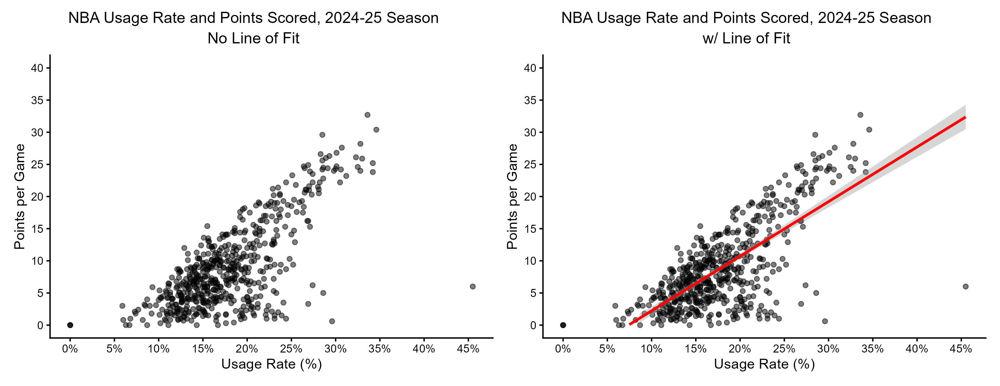
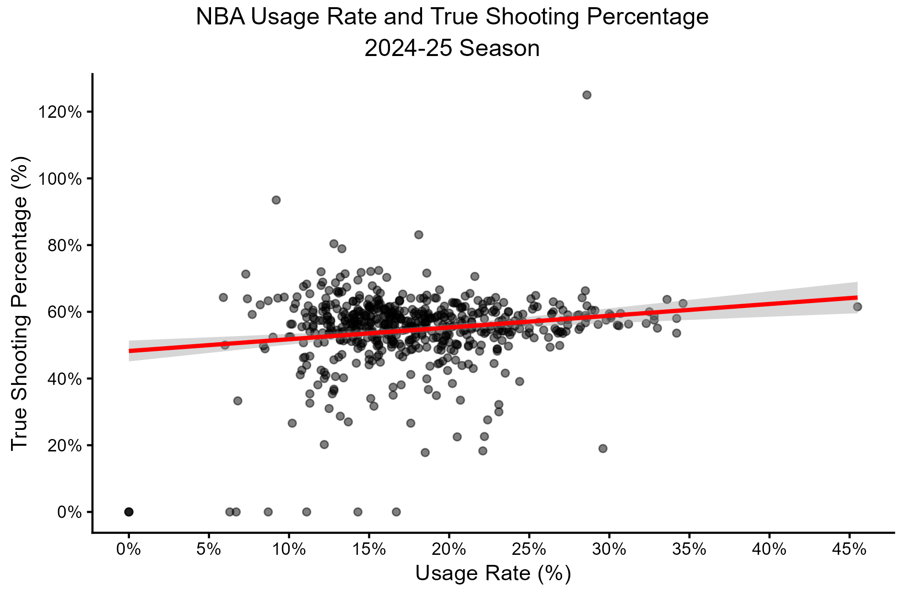
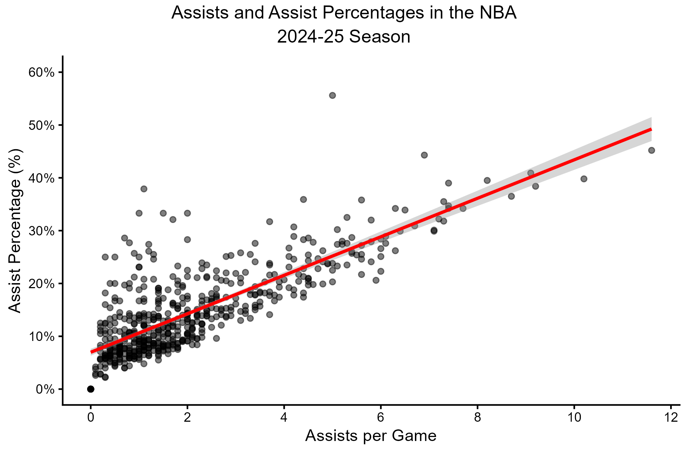
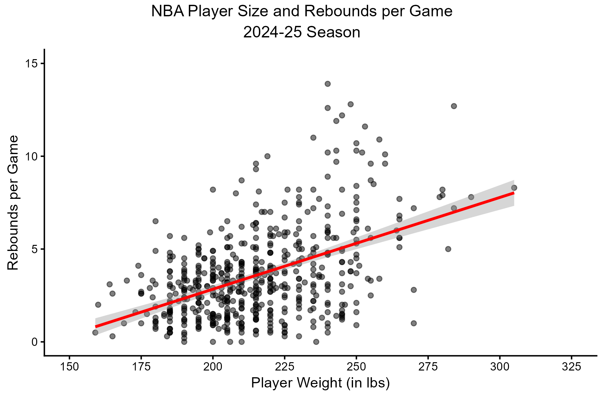
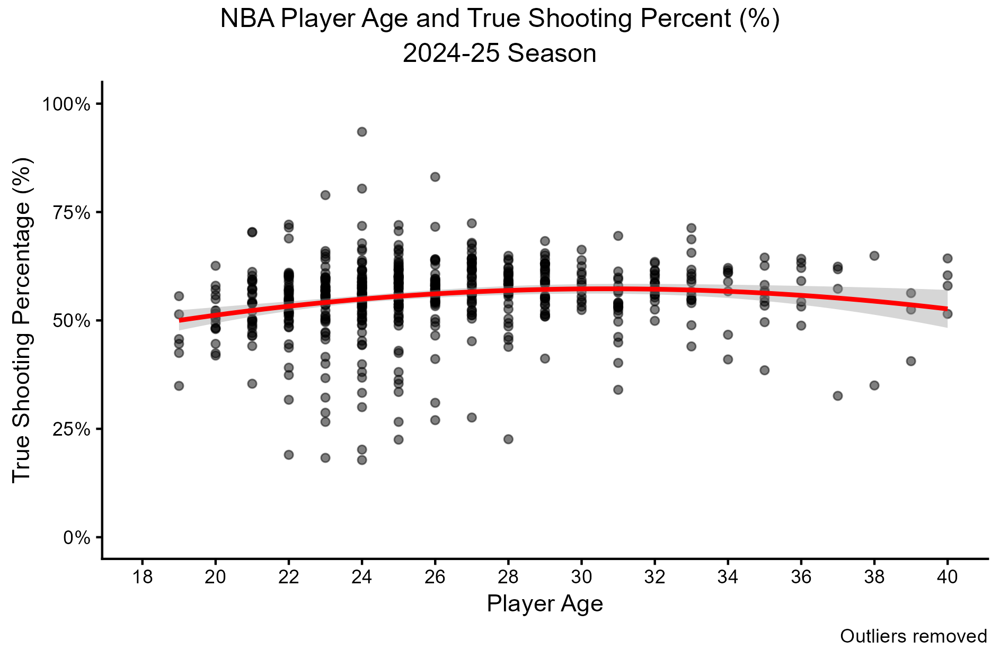

```{r setup, include=FALSE}
knitr::opts_chunk$set(echo = TRUE)
#import libraries
library(ggplot2)
library(dplyr)
library(scales)
library(ggpubr)
library(tidyr)

```

## Repo and Data Summary

All scripts, outputs, and figures can be found in the correspondingly named folders in the **11_week** folder of this repository. A summary of the file structure can be found below. For this assignment, we will be working with the *cleaned* version of the `basketball.rds` provided, titled `basketball_clean.csv`. We will review the steps taken to clean the raw data in the next section.

```{r}
#check repo and file structure
getwd() #"C:/Users/abiwe/OneDrive - The Pennsylvania State University/PLSC - Political Science/PLSC 498.1 - Visualizing Social Data/plsc_498"

list.files("11_week") #"data", "figures", "outputs", "problem_set", "scripts"
list.files("11_week/data") #"basketball.rds", "basketball_clean.csv"
```

The raw data found in `basketball.rds` contains $569$ observations across $24$ variables. Despite being primarily numeric in actual value, the data itself was formatted as character vectors. As such, it was necessary to transform all of these columns to the correct data type. This was completed using the `mutate(across(...), as.numeric)` command grouping. After this was completed, we also created an additional column indicating whether or not the player observed was drafted or not. We calculated the column values (`DRAFT_STATUS`) using the values from the `DRAFT_ROUND` column. Any player who had a value of "`undrafted`" in this column was flagged as being "`UNDRAFTED`" in `DRAFT_STATUS` . All other players were flagged as "`DRAFTED`". The final step in cleaning our data was to ensure that all variables that we will be using in the assignment `(AGE`,`PTS`, `REB`, `USG_PCT`,`TS_PCT`,`AST`,`AST_PCT`, and `PLAYER_WEIGHT`) were not missing any values. Observations missing any of these values were removed from the data set. The resulting cleaned data set dropped two rows and added one column to our raw data.

```{r}
#import data
basketball <- readRDS("data/basketball.rds")
basketball_clean <- read.csv("data/basketball_clean.csv") %>% select(-c(X))
#compare and summarize data
dim(basketball) #rows: 569, columns: 23
dim(basketball_clean) #rows: 567, columns: 24

basketball_clean %>% select(c(AGE, PTS, REB, USG_PCT)) %>% summary()
```

Before we begin exploring the relationships between NBA statistics, we should briefly explore the stats themselves. In summarizing a few select variables, we find that many of the raw values are skewed. Some of these are expected, such as `AGE`, which is skewed right due to the greater concentration of younger players in the league. Similarly, `POINTS` and `REB` are skewed right, with most players scoring relatively few points per game. Some players - those that start every game, perhaps - have high season averages, but the majority fall on the lower end of the spectrum. When considered as a proportion of playing time (i.e. `USG_PCT`) though, we see that the data is less skewed.

It should be noted that all game play statistics are presented as season averages rather than totals or single game stats. This is why we have players scoring fractions of points and having partial assists in the data.

The primary goal of this lab is explore relationships between player demographics and usage against their performance on the court. To do so, we will be exploring relationships between player use (`USG_PCT`) and scoring (`POINTS`), scoring efficiency (`TS_PCT`), and assists/assist percentage (`AST`/`AST_PCT`). Then we will examine relationships between player size (`PLAYER_WEIGHT`) and rebounding (`REB`) and player age (`AGE`) and scoring efficiency (`TS_PCT`).

## Relationship 1: Player Usage and Scoring Metrics

### Sub-relationship 1: Player Use and Scoring

The two plots below display the usage rate for each player comparative to the average number of points they score per game. Usage rate, or NBA usage percent, is a measure that determines how much a player is used in plays while on the court. The higher the usage rate, the greater the proportion of plays he was involved in while actively playing. It logically follows that the more a player is involved in team plays, the more they will score. As such, we expect to see a positive linear relationship between the two variables in our plots.



This assumption holds true, with a very clear linear pattern represented even without a line of fit included. It should be noted that the line of fit does not exactly follow the slope of the majority of the data though. This is because of an abnormally high usage rate + low points scored observation dragging the line down. Paired with fewer observations at the high end of our usage rate scale, the line of fit is pulled down. The lack of observations at this point also increases the standard error of our predicted values at this point in the graph, which is represented by the grey ribbon around the line of fit. Standard erros represent the variability of the where the true value falls in relation to the predicted value. As such, the wider standard error here combined with the singular low value pulling the line down should make us more skeptical of the presented trend line - there is more variability present within the prediction. The probable outlier alters our trend line greatly, especially when there are so few additional observations to counteract its weight. Excluding this point, we see a very clear trend presented that is likely more accurate to the true relationship between usage rate and points scored.

### Sub-relationship 2: Player Use and Scoring Efficiency

While looking at usage rate in relation to raw scoring ability is certainly important, it does not give us a picture of how effective a player is at scoring. As such, we will now examine the true shooting percentage in relation to usage rate. True shooting percentage is a metric that examine points scored as a proportion of field goal and free throw attempts. It should be noted that this metric does not account for *three-point field goals* in its calculations, which is why we see observations with a true shooting percentage of over $100$%.



Interestingly, the above plot shows that there is not a very significant relationship between the two statistics. Those that did not get used in plays and therefore did not score draw the trend line lower at one end of the relationship and a lack of observations around higher usage rates do artificially create slightly positive relationship between the two, but when considering the variability indicated standard errors, there is almost no correlation indicated by the plot. There is a good bit of variation in true shooting percentage, but it consistently clusters around the \~$60$% mark regardless of usage rate. We should address why we are consistently seeing increased standard error estimates at either end of the relationship in the context of the actual problem. Yes, there are a lack of observations at either end of the spectrum, but this is likely because teams try to use *all* their players at some point during the season. A few players will be benched and some will play significantly more than others but generally, coaches want to ensure that players are in fact playing. It seems that the majority of players are used in team plays $10$ - $25$% of the time they are on the court.

### Sub-relationship 3: Assists and Assist Percentage

Our final scoring efficiency relationship we will be examining is the relationship between assists and assist percentage. Assists are passes that a player makes that directly leads to a field goal. The assist percentage is the percentage of field goals made by a team that the player has assisted. We anticipate seeing a positive linear relationship between the two, as an assist increases the total number of field goals made by the team and the number of total assists a player has made.



Again, we this assumption to hold true in the above figure. As with our other plots, we do see that uncertainty in predicted values does increase as assists increase because of a lack of observations contributing to the calculation. Generally, though, we are confident in this positive linear relationship. Despite what some may assume, the relationship between assists and assist percentage is not a one-to-one linear relationship. A player may have many assists but a low assist percentage because their team scores a large number of field goals. Conversely, a player may only have a few assists but because their team does not regularly score field goals, their assists account for a larger proportion of those field goals occurring.

What is revealed in many of these plots is that basketball statistics and scoring is not reliant on raw individual performance, but also team performance. An individual may perform well independently, but they also need to perform well within their team to indicate effectiveness on the court.

## Relationship 2: Player Size and Rebounding

Of course, player performance is not based solely in how they work with their time, but also in raw physical skill and strength. We explore this through determining the relationship between player weight and rebounds. A rebound is when a player gains possession of the ball after a missed shot. From my understanding, gaining possession of the ball after a missed shot requires more physical force and general presence than most other aspects of the sport. Because of this, we expect to see a greater number of rebounds among those players who are heavier and have the ability to command that space of the court. The fairly strong positive linear relationship displayed in the figure below supports this assumption.



## Relationship 3: Player Age and Scoring

The final relationship we want to examine is player age and scoring efficiency using true shooting percentage. This addresses the question of whether there is a peak age of performance among basketball players. It should be noted that players with a shooting percentage of $0$% or over $100$% were discarded to more clearly show the relationship between the two variables.



The relationship between age and true shooting percentage is quadratic, meaning that the trend line will be shaped like a parabola rather than a straight line. Aging often means physical decline after a certain point, which means that while there will be initial improvements in performance as a player gets older, there will come a point when that performance begins to decline. The figure above does reflect this idea, although not as strongly as one may have expected. This may be a result of lower-performing older players retiring sooner than the higher-performing players in the same cohort. This trend would also explain why the standard error ribbon increases in size as age increases - there are fewer players of those ages to contribute to the data. Though it is difficult to tell due to the very slight nature of the displayed relationship, it appears performance peaks when a player is around $30$ years of age or a bit younger.

## Exploring Plotting Decisions

In every plot created for this lab, we opted to use transparency for the plotted points to ensure that all observations were able to be seen and to highlight clusters. The lines of fit were colored red to bring them to the viewers attention more clearly. Every axis was custom created to ensure that viewers could more accurately identify values corresponding with the data points.

Beyond these aesthetic decisions, we also needed to determine how to treat abnormal observations in the plots. For the most part, these points remained in our figures. For example, the player with a $45$% usage rate and low points scored remained in our first figures, as did the player with a $120$% true shooting percentage. The first player is likely a more defensive or assist-heavy player, which explains why there are lower points scored despite a significant amount of involvement in plays. The second likely favors three-point field goals, which was briefly explained previously. These abnormal observations remind us that despite existing relationships, it is difficult to completely generalize those conclusions when there are so many different factors at play.

## Git Hub Confirmation

```{r}
#
#
#
#
```
