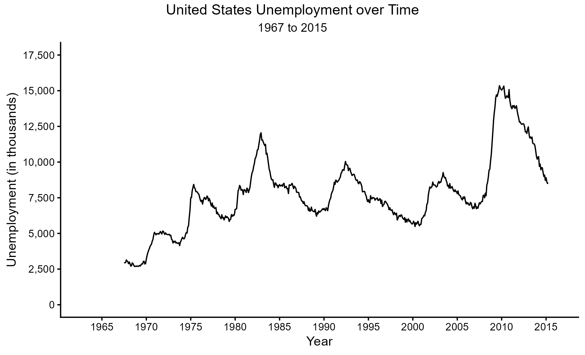
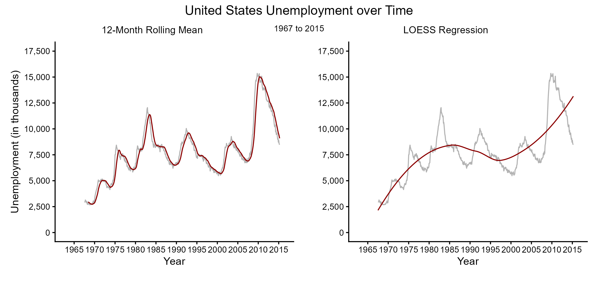
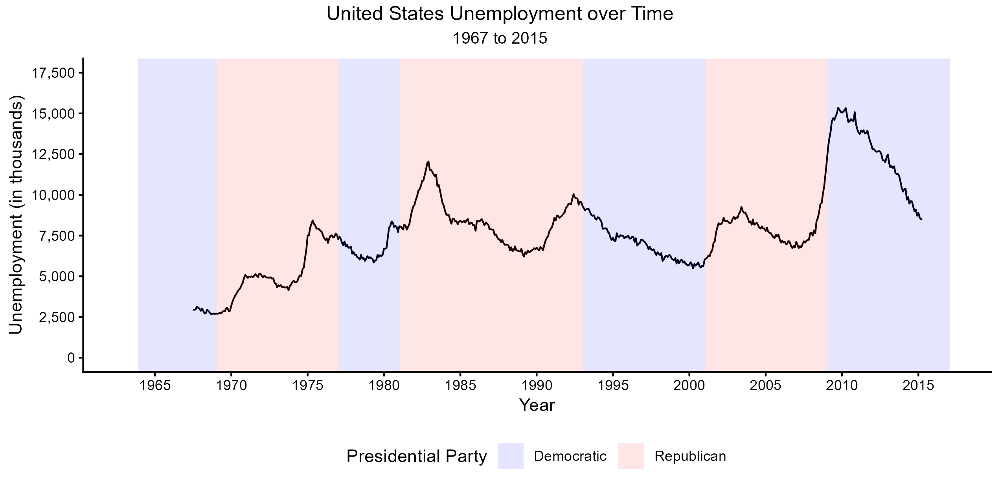
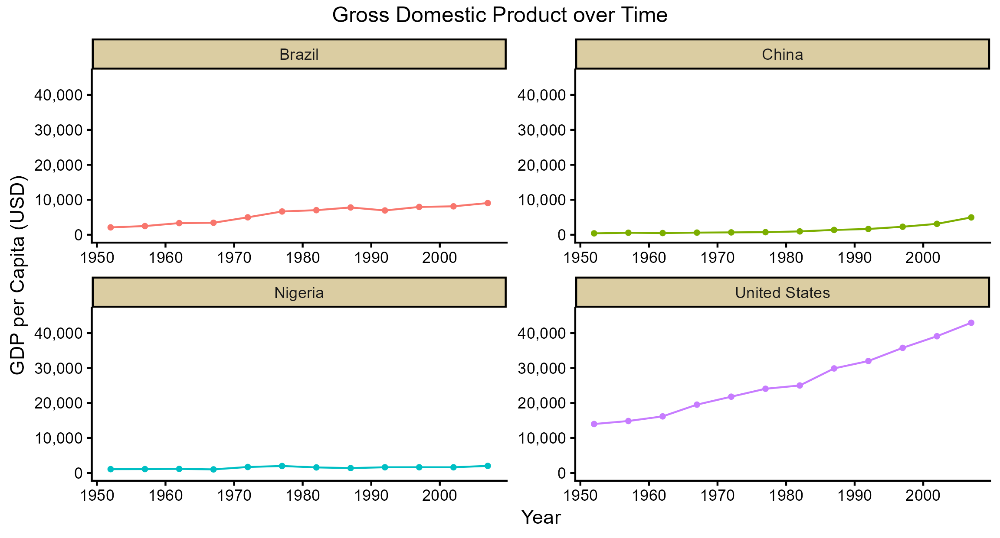

```{r setup, include=FALSE}
knitr::opts_chunk$set(echo = TRUE)
library(ggplot2)
library(dplyr)
library(tidyr)
library(ggpubr)
library(scales)
library(patchwork)
```

## Data Set-Up and Exploration

All files for .R scripts, data sets, and figures can be found in their respectively named folders within the **12_week** folder of this repository. For this assignment, we will be using multiple data sets pulled from the `ggplot2` and `gapminder` package. They are also saved as `.csv` files in the data folder of this repository. The data used comes from the `economics` and `presidential` data sets of the `ggplot2` package and the `gapminder` data. We will use a variety of data points from each of these data sets to create time series plots of national economic measures.

```{r}
getwd() #"C:/Users/abiwe/OneDrive - The Pennsylvania State University/PLSC - Political Science/PLSC 498.1 - Visualizing Social Data/plsc_498"

list.files("12_week") #"data", "figures", "outputs", "problem_set", "scripts"   

list.files("12_week/data") #"economics.csv", "economics.rds", "gapminder.csv", "gapminder.rds", "presidential.csv", "presidential.rds"
```

Before we can build these time series plots, we must explore and clean the data where necessary. We also should understand how each data set is constructed, as this will help us with plotting.

```{r}
#load data
economics <- read.csv("data/economics.csv")
presidential <- read.csv("data/presidential.csv")
gapminder <- read.csv("data/gapminder.csv")

#explore data
dim(economics) #rows: 574, columns: 6
names(economics) #"date", "pce", "pop", "psavert", "uemped", "unemploy"

dim(presidential) #rows: 12, columns: 4
names(presidential) #"name", "start", "end", "party"

dim(gapminder) #rows: 1704, columns: 6
names(gapminder) #"country", "continent", "year", "lifeExp", "pop", "gdpPercap"
gapminder %>% select(c(year)) %>% summary(gapminder) #years: 1952 - 2007
```

The first data set we are working with, `economics`, has $574$ observations across five economic metrics. These observations correspond to a given month. The data spans from July of $1967$ to April of $2015$. Our primary variable of interest, beyond `date`, in this data frame is `unemploy`. This is the count of unemployed individuals in the United States during a given month. This is what we will be mapping first once we begin designing the time series plot. Our second data set, `presidential`, is supplementary to the first. `presidential` summarizes the terms of the last twelve presidents by their start date (`start`), end date (`end`), and associated political party (`party`). We will use this information to annotate later unemployment graphics.

The final data frame, `gapminder`, is a country-year data set that has observations for $142$ countries from $1952$ to $2007$. Observations are spaced at five-year intervals, resulting in a total of $1,704$ observations. Data associated with each country-year is related to population metrics - specifically life expectancy, population, and gross domestic product (GDP) per capita. We will use this final metric to compare GDP per capita over time across different countries.

## Unemployment Trends

The first task assigned was to create a generic time series plot of unemployment count over time. For all the following time series plots of unemployment, the data will span from $1967$ to $2015$. Data is plotted by month. A general rule of thumb for these visuals is that greater the associated unemployment value, the worse the economy is.

{width="535"}

As we can see from the first visual, there is a significant amount of noise in the plot introduced by month-to-month variation in the data. Beyond this, there is a fairly consistent pattern of peaks and valleys within the data - likely aligning with economic expansion and contraction over time. The primary trend is what we wish to address in the data though. While it is difficult to clearly see with the noise and seasonal components of the data, it appears that unemployment increased fairly steadily in the $1970$s, became varied in the $1980$s and $1990$s, before rapidly increasing and decreasing around the $2008$ recession. It should be noted that this data is a raw count of unemployment - it does not address unemployment in relation to the working population. This means that trend may also be reflective of general population growth in addition to variations in unemployment. Regardless, without additional visual aides, the exact trend of unemployment is difficult to clearly see, especially to someone without experience working with times series data. Because of this, we incorporate smoothing lines into the visuals of the next figure to aid in interpretation.



There are many different ways to display trends found within a time series alone. More complex methods involve decomposing the data such that seasonality, noise, trends, and residuals are all plotted separately. This is fairly complex for exploratory graphics though, so we can also fall back on smoothing. We display two approaches to smoothing above. The first, rolling mean smoothing, takes the average of the previous $k$ observations and plots that as the associated point for a given date. This reduces the noise displayed by the line plot. For this example, we utilized an annual rolling mean, taking the average of the previous twelve months of data. The second approach utilizes a localized regression and plots a line of fit over the data that should mirror the general trend displayed.

With the rolling mean smoother, we lose much of the noise in the plot, but still maintain the cycles displayed in the original data. This better highlights the periods of intense economic expansions and contractions due to that reduction of noise. It still fails to identify a monotonic trend in the data though. The LOESS smoother does a better job of this, although the trend will never be completely monotonic. Rather, it shows the increasing unemployment through the $1970$s and $1980$s, the brief recovery period, and then another increase in the early aughts. This trend better reflects the general state of the economy over time, neglecting "sudden" shocks and spikes that occur regularly in favor of the general direction of the data. For our data, the LOESS smoother hides important events such as recessions and incorporates them into the general trend, which can be misleading.

We may be able to better tie events to moments of higher or lower unemployment rates through annotating our time series with presidential term data pulled from the `presidential` data set. This highlights what political party was in control of the executive branch relative to unemployment counts. While there is no explicit relationship between which party had the "best" economy, there does appear to be a trend in executive control exchanging parties during or directly after periods of increased unemployment. This follows what we know about electoral behaviors and their relation to economic trends. Beyond highlighting this relationship, though, including presidential party does not seem to add much to our series. In fact, it segments it in an unnatural way that can distract from the trends we are supposed to be exploring. This may be a result of how presidential term was plotted (a simple vertical line for each party switch may have been more helpful), but the end result would be just as distracting from the actual trend.



## GDP per Capita by Country

The second task given was to compare GDP per capita over time between various countries. For this task, the most populous (or near most populous) nations on various continents were selected. Scales are fixed such that all time series plotted can be compared to each other without additional cognitive load being placed on the viewer. Possible adjustments include using a logarithmic scale for our GDP data, but it is my belief that highlighting the sheer difference in scale is important for this visual.



In these plots, we can see that compared to the United States most countries have had fairly slow growing economies over the period from $1950$ to $2010$. Brazil has seen consistent, gradual growth in GDP per capita over time, while China has only recently seen an apparently exponential increase. Nigeria, on the other hand, appears to be almost completely stagnant at this scale. It is very difficult to fully explain why there are such differences in the data, as it involves a detailed history of colonization, exploitation, governance, and international relations. It is even more difficult to do so when the details of each time series are clearly displayed (examine Nigeria's raw data). The general trend that we do see across all countries is that there is an increase, even if it is smaller compared to another nations change.

## Git-Hub Confirmation

```{r}
##git status: 
# On branch main
# Your branch is up to date with 'origin/main'
# nothing to commit, working tree clean
#
#git log -1:
#
#Author: weinsteinabi <abiweinstein@gmail.com>
#Date:   Fri Apr 10 2026
#        push week12 lab
#


```
