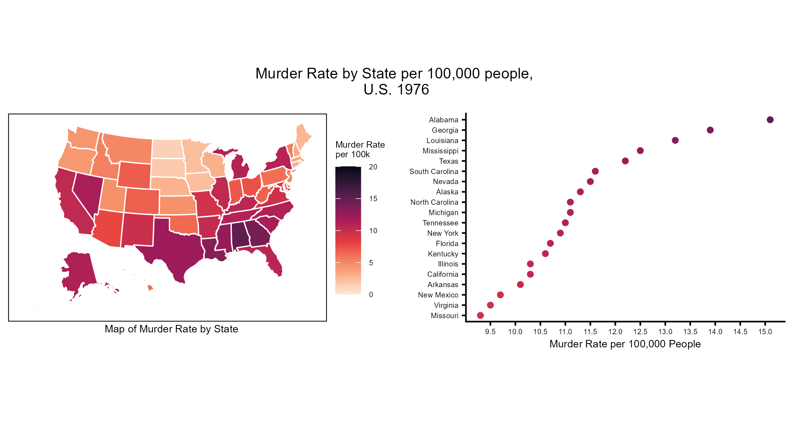
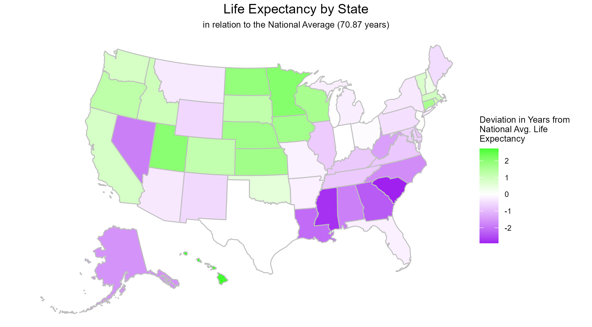
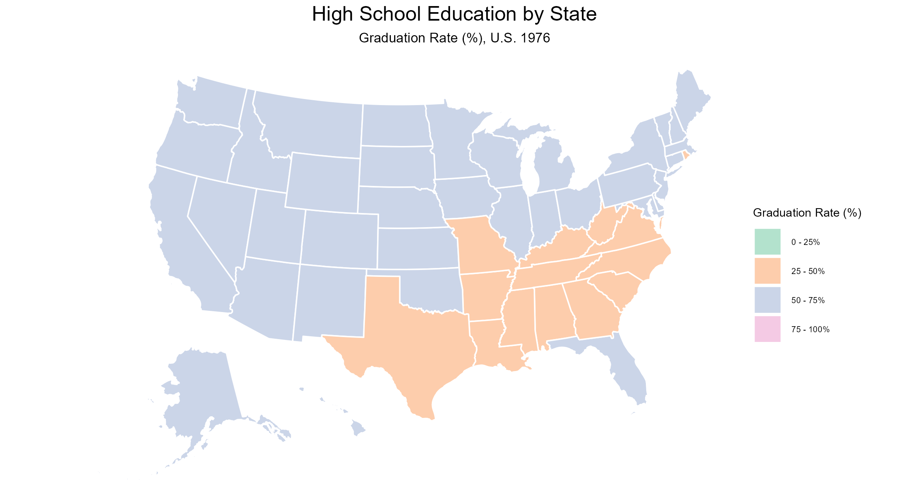

```{r setup, include=FALSE}
knitr::opts_chunk$set(echo = TRUE)
library(dplyr)
library(tidyr)
library(ggplot2)
library(ggpubr)
library(readr)
library(patchwork)
library(usmap)
library(stringr)
```

## File Structure and Data Exploration

As with all past assignments, all data files, figures, and scripts can be found in their respectively named folders within the `13_week` folder of this repository. For this assignment, we will be utilizing data from the `state_data.csv` file mapped to the location data stored in `us_arrests.csv` . Both sets of data originally come from .`R` packages, but have since been cleaned and transformed into `.csv` files.

```{r}
#check directory
getwd() #C:/Users/abiwe/OneDrive - The Pennsylvania State University/PLSC - Political Science/PLSC 498.1 - Visualizing Social Data/plsc_498"

#check files
list.files("13_week") #folders: data, figures, outputs, problem_set, scripts
list.files("13_week/data") #files: state_data.csv, us_arrests.csv, us_states.csv
```

Our first data set, `us_states.csv` , contains a set of coordinates for various pieces of the United States and the District of Columbia. Observations are grouped by region (state) and sub-region. This information will be appended to the information stored in `state_data.csv`, which contains the data relating to the trends we wish to explore. `state_data` contains a singular observation for each state in the United States across various points of interest, including life expectancy, murder rate, population, and graduation rates. We will be examining these variables across the country to see if there is substantial difference in data based on state or region. It is anticipated that there will be in interest areas like murder rate, which has a fairly wide spread. Murder rates range from 1.4 murders per 100,000 people to over 15 murders per 100,000 people. Others, we do not anticipate there to be striking differences based on preliminary exploration. For example, life expectancy data is fairly tightly clustered, with the largest deviation from the national average of \~70 years being a three years in either direction.

```{r}

#import data
us <- read_csv("data/us_states.csv")
state_data <- read_csv("data/state_data.csv")

#explore data
dim(us) #rows: 15537, columns: 6
names(us)
head(us$region)

dim(state_data) #rows: 50, columns: 9
names(state_data)
head(state_data$region)

summary(state_data$Life.Exp) 
summary(state_data$Murder)
```

To explore this information, we must join our two data sets. This means that the variable that we are joining on, `region`, is consistent across both data frames. We check this using the `head` function. After we merge, there are a few transformations we need to make to the data to suit the visualizations we are interested in making. They are as follows:

-   Create a `life_dev` variable: measures deviation from national average life expectancy

-   Create binned graduation variable: groups state graduation rate in specific ranges, becomes a categorical variable

-   Capitalize state names - for aesthetics in later plots

-   Create a sub category of "Top 20 States" by murder rate

In the initial iterations of creating maps with this data, it was noted that there was no inclusion of Alaska and Hawaii due to the type of mapping command being used. This caused us to pivot to using `plot_usmap` from the `usmap` package. To make plotting with this package faster, we created a duplicated data set of our initial merged set that dropped all duplicated rows once location data (besides region) was removed. In `scripts/lab.R`, there are visuals made with both `plot_usmap` and `coord_quickmap`, but all visuals shown in this document were created with `plot_usmap`.

## Murder Rate by State

The first task of this assignment was to explore murder rates across the country. This information is encoded in a choropleth map and a dot plot showing the 20 states with the highest murder rates. Murder rate is represented as the number of murders that occur per 100,000 people. This data is presented on a continuous, sequential scale.

{width="786"}

From the map, we can clearly see that Alabama is the state with the highest murder rate and that the South is the region with higher murder rates comparative to other regions of the country. The map is very useful for identifying regional trends and states with high and low rates. However, there is some limitation to its ability to convey actual numeric information, which is where the dot plot becomes useful. Here, we can not only identify the murder rate for each state, but see how truly different murder rates are between states. We know that Alabama has a noticeably higher murder rate than its neighbors and all other states generally, but the dot plot allows us to see the magnitude at which this difference exists: 15.1 murders per 100,000 vs less than 14 murder per 100,000. If one wishes to generally explore trends, the map would be suitable, but the dot plot provides numeric information more clearly. The dot plot can also be more easily manipulated to include information on population size or region, which would highlight some of the trends shown in the map. I opted to redundantly encode murder rate in the dot plot using the same color scale as the map to more clearly link the two in the visual. Had this been an independent visual, I would have used one of the other strategies mentioned previously.

## Life Expectancy by State

We are now going to evaluate life expectancy by state based on how it varies from the national life expectancy. This was identified as the age of 70.87 years of age. States with a life expectancy lower than the national average are purple and those with a higher life expectancy than the national average are green. Hue increases in intensity the further away from the national average a state's life expectancy is.



Encoding data this way allows us to set the middle point as the national average and envision differences relative to that value. As a sequential series, this would be significantly more difficult to identify, especially as the data is so tightly contained within a six year span. The middle point would not be clear, nor would the differences between states be as prominent. With this data, we do again see regional trends, with a large number of states in the South having lower life expectancies.

## High School Education by State

The trend of the South being differentiated from the rest of the country continues as we explore high school education by state. Measured by graduation rate, we binned data so that states fell into one of four categories: 0 - 25% of people graduate, 25 - 50%, 50 - 75%, and 75 - 100% of people graduate. In the map below, we can see that the south consists almost entirely of states falling in the 25-50% bin, while the rest of the country (with the exception of Rhode Island) is in the 50-75% bin.



While this data establishes that there is lower levels of education received in this region of the country, it hides the extent to which that difference exists. Binning this data in this way means that a state with a 49.5% high school graduation rate is categorized differently than a state with a 50.2% high school graduation rate despite being incredibly close. This is a very helpful visual for identifying general trends, but it hides which states are on the cusp of a bin and those that are well within them. In the real world, this would have significant implications on education policy initiatives and their targets.

## Git-Hub Confirmation

```{r}
##git status: 
# On branch main 
# Your branch is up to date with 'origin/main' 
# nothing to commit, working tree clean 
#
##git log -1: 
#Author: weinsteinabi abiweinstein@gmail.com 
#Date: Fri Apr 17 13:12:59 2026 
# push week13 lab
```
