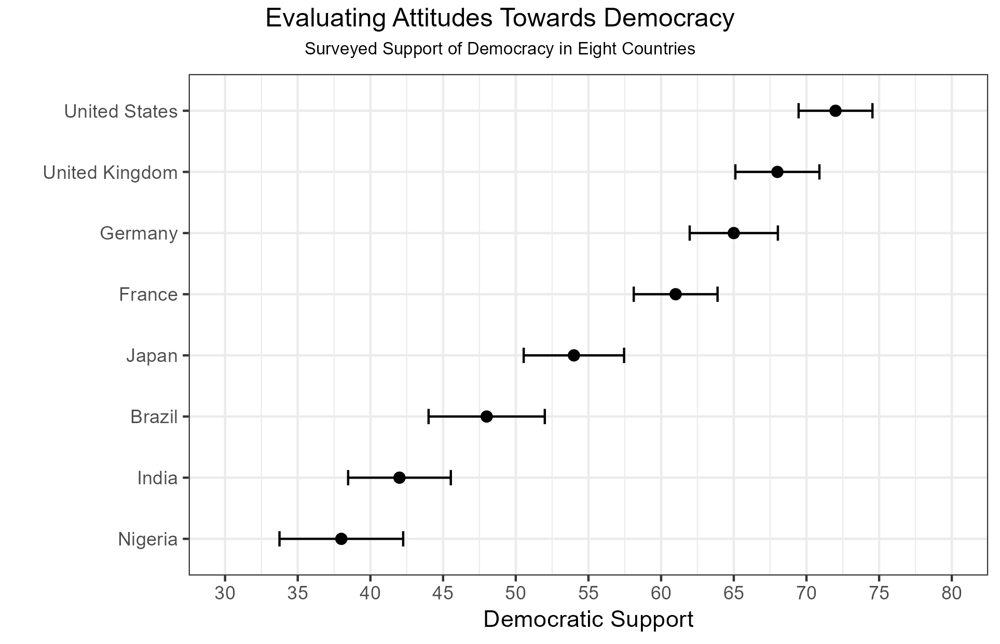
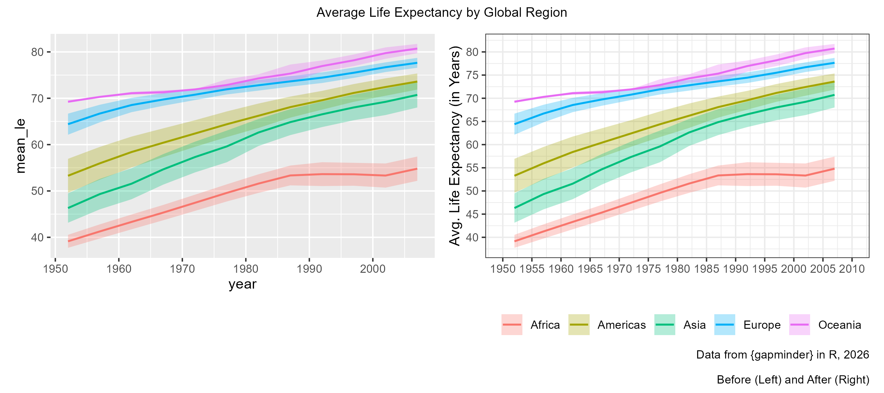
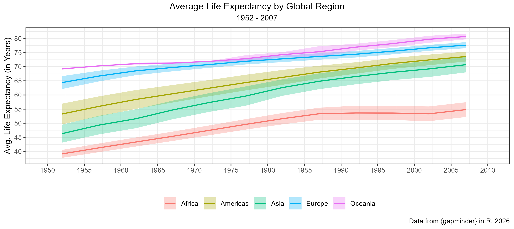
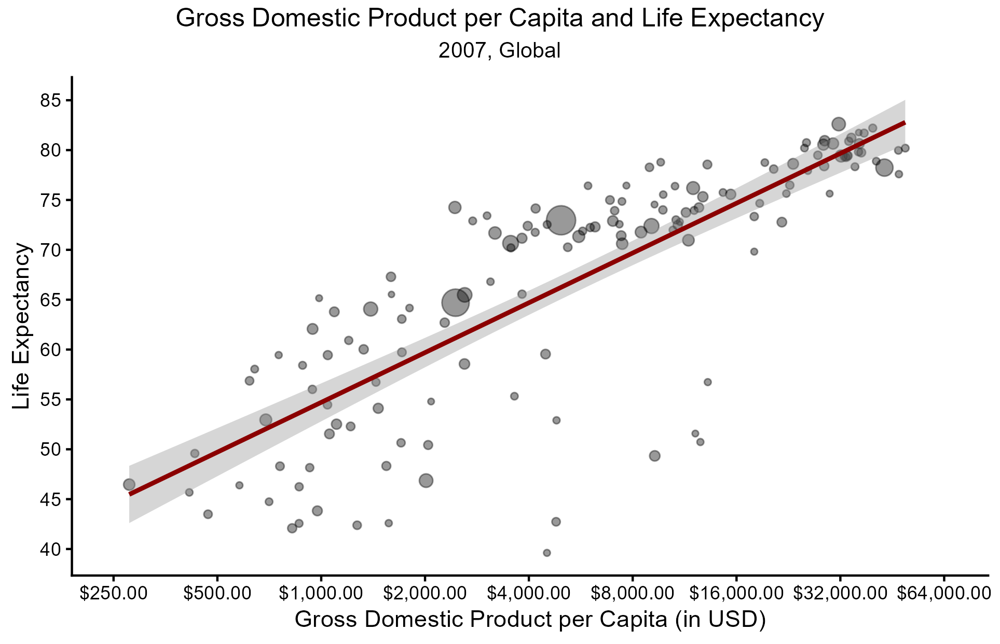

```{r setup, include=FALSE}
knitr::opts_chunk$set(echo = TRUE)
#import libraries
library(dplyr)
library(tidyr)
library(ggplot2)
library(ggpubr)
library(scales)
library(readr)
```

## File Structure and Data Exploration

All scripts, figures, and data sources can be found in the folder `14_week` in this repository. Each of these files is in their respectively named folder. For this week's lab, we will be working with data from two data sets - data from the `gapminder` package in R (`gapminder.csv`) and simulated survey data (`survey_democracy.csv`). We will be using these to explore international trends in democracy, life expectancy, and economic security.

```{r}
#get directory info
getwd() #"C:/Users/abiwe/OneDrive - The Pennsylvania State University/PLSC - Political Science/PLSC 498.1 - Visualizing Social Data/plsc_498"
list.files("14_week") #data, figures, outputs, problem_set, scripts
list.files("14_week/data") #gapminder.csv, survey_democracy.csv
```

The first data set, imported as `gap`, consists of $1,704$ observations across a span of $55$ years and six variables. Observations are recorded on five year intervals and are representative of $142$ countries globally. Information recorded across these countries includes continent, observation year, life expectancy, gross domestic product per capita, and total population.

Our second data source, simulated survey data (`survey`) observes eight countries and their population's support for democracy. Democracy score is represented on a scale of 0 to 100. In addition to these two metrics, number of surveyed individuals, standard errors, and bounds for the $95$% confidence interval are included.

```{r}
#import data
gap <- read.csv("data/gapminder.csv")
survey <- read.csv("data/survey_democracy.csv")

#exploring data
dim(gap) #rows: 1,704 columns: 6
names(gap) 
summary(gap$year) #years: 1952 - 2007

dim(survey) #rows: 8 columns: 6
names(survey)
```

## Support for Democracy by Country

The first task we complete will use the second data set, `survey`. We will plotting the surveyed support for democracy across the eight countries with their $95$% confidence intervals. Countries surveyed are as follows: United States, United Kingdom, Germany, France, Japan, Brazil, India, and Nigeria. They are plotted (and listed) in order of greatest democratic support to lowest.



We include these confidence intervals to help identify where the "true" population support for democracy may lie. With infinite sampling, 95% of reported democratic support scores should fall within the identified intervals. This does indicate to us that the ordering of countries presented may not be entirely accurate, as there is bit of overlap across most observed nations. True democratic support in the United States, for example, may be lower than true democratic support in the United Kingdom based on the overlapping of lower and upper bounds for each country's reported confidence intervals. Likewise, Germany may have greater support than the UK OR less support than France. While we can not order these countries perfectly based on civilian support for democracy, we can segment them into two clearly ordered groups. The first group contains the United States, UK, Germany, and France. There is intersection across confidence intervals for these nations, but they do not cross any of the other countries. The other group contains Japan, Brazil, India, and Nigeria. They all have intersecting confidence intervals as well, but do not interact with the "western" nations ranked above them. While this data is simulated, it has some very interesting implications about democratic support across regions that were democratized earlier (regardless of any following lapses). Highlighting this confidence/uncertainty in our visual is vital, as it indicates to us that ordering these nations based solely on their estimated democratic support may not be an accurate representation of reality.

## Life Expectancy by Region

We continue explore regional trends in the next task, which explores life expectancy over time by region. In this exploration, regions are grouped as follows: Africa, Asia, Europe, Oceania, and the Americas. These do not follow typical regional divides, but allows for ease of visualization. In addition to exploring these trends, we will also be discussing the importance of visualization design. In the figure below, we can see the same information plotted before and after refining.



As in the prior visualization, the uncertainty bands (which are the same as $95$% confidence interval) do indicate that the trend lines we see may not be the exact trends that are occurring in reality. At any given point across regional trends, there may be rises and drops that are not properly shown in the existing data. The wider this interval, the greater probable variation. This indicates to us that life expectancy in regions like the Americas and Asia are highly variable. It should also be noted that these values are based on regional averages, meaning that significant changes may either be hidden due to contrasting trends in other parts of the region. This also contributes to widening confidence intervals and increased variation.



To better visualize these trends, the following improvements were made to the base visual:

-   Axis Titles: Axes were labeled to indicate what exactly is being plotted over time in a clear way (Average Life Expectancy vs. mean_le)

-   Theme: Plot theme was set to `theme_bw` to reduce visual stimulus and more clearly show trends (axes remain to serve as reference points)

-   Title + Captions: Including a title, subtitle, and caption helps the viewer understand what is being shown, additional details, and data sources. This is necessary to interpret the visual and recreate the visual.

## Gross Domestic Product per Capita + Life Expectancy

The final visualization we made explores the relationship between GDP per capita and life expectancy in 2007. Each point in the presented visual represents a country. The size of the point corresponds to that country's population. Included in the visual is the trend line for the relationship between GDP per capita and life expectancy. It should be noted that the GDP per capita is presented on a log-base 10 scale to more clearly show all data points.



The figure presents the idea that there is a positive relationship between GDP per Capita and Life Expectancy. While it appears to be linear in this visualization, it is truly an exponential relationship. This visual also presents the confidence interval for this relationship in the shaded ribbon surrounding the trend line. This indicates to viewers where the true trend line and relationship between our two variables of interest most likely exists given the provided data. This confidence interval contains slope estimates that may increase or decrease the degree of relation between GDP per capita and Life Expectancy.

## Git-Hub Confirmation

```{r}
#git status: 
# On branch main
# Your branch is up to date with 'origin/main'
# nothing to commit, working tree clean
#
#git log -1: 
#
#Author: weinsteinabi <abiweinstein@gmail.com>
#Date:  Thu Apr 23 12:19:59 2026
#       
#        upload week 14
```
